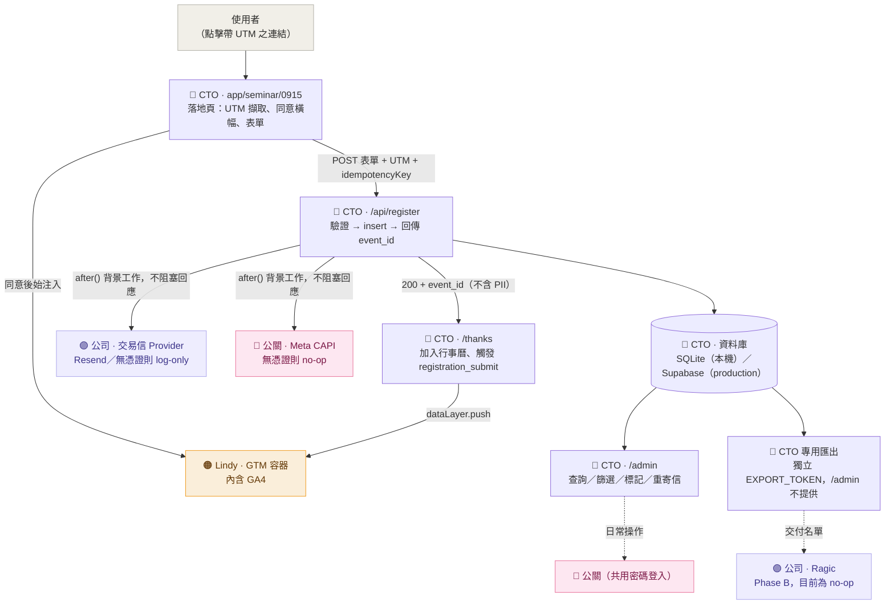

# Agatha 9/15 論壇報名系統


-SQLite-003B57?logo=sqlite&logoColor=white)
-Supabase_Postgres-3FCF8E?logo=supabase&logoColor=white)


> 對應交接文件《Agatha_Seminar_Landing_Page報名系統與追蹤_CTO交接文件_0729》，實作文件 §0 指派予 CTO／工程之範圍：**報名頁與自建後台、GTM 埋設、GA4／Meta 像素整合、交易信 API 串接與網域驗證、感謝頁、UTM 落庫、後台權限開放予公關**。

規格文件位於 [`openspec/changes/add-seminar-registration-system/`](openspec/changes/add-seminar-registration-system/)（proposal / design / specs / tasks）；本 README 為系統操作手冊，完整 phase-by-phase 開發歷程與遭遇問題記錄於 [`devlog.md`](devlog.md)。

**目前狀態：本機／staging 驗證通過（詳見下方「已完成測項與待驗證測項」），尚未部署至 production 或 agatha-ai.com。**

---

## 目錄

- [專案說明](#專案說明)
- [與原型 HTML 差異](#與原型-html-差異)
- [角色與分工](#角色與分工)
- [系統資料流](#系統資料流)
- [專案結構](#專案結構)
- [測試步驟](#測試步驟)
- [`.env` 環境變數說明](#env-環境變數說明責任分工對照文件-011)
- [`/admin` 操作說明](#admin-操作說明)
- [已知偏離計畫事項](#已知偏離計畫事項)
- [§12 測試表對照](#12-測試表對照已完成測項與待驗證測項)
- [待確認事項](#待確認事項可轉知-lindy公關)
- [後續規劃](#後續規劃對照文件-10-關鍵時程)
- [專案進度追蹤](#專案進度追蹤)

---

## 專案說明

Next.js（App Router + TypeScript）全端專案：

- `/seminar/0915` — 報名落地頁（沿用已核准之靜態設計 `agatha-seminar-landing-0803.html` 的文案與樣式，改以 Next.js 頁面實作，並補上實際送出邏輯）
- `/seminar/0915/thanks` — 感謝頁（文件 §8.2 官方文案，含加入行事曆、觸發 `registration_submit`）
- `/admin` — 公關使用之報名後台（V1：單一共用密碼）
- `/api/register` — 報名寫入 API（驗證 → 寫庫 → 非同步寄信／推送 Meta CAPI）
- `scripts/export-registrations.ts` + `/api/export` — CTO 專用名單匯出（`/admin` 介面不提供此功能，詳見下方說明）

---

## 與原型 HTML 差異

畫面（文案、版型、圖片、動畫）**沿用原型 `agatha-seminar-landing-0803.html`，未重新設計**。差異集中於「送出之後的處理流程」：

| 項目 | 原型 HTML | 本次 Next.js 實作 |
|---|---|---|
| 送出表單後 | 純前端 JS 驗證欄位，通過後將表單隱藏並切換為「已送出」畫面——**資料未經任何儲存**，重新整理即消失 | 實際呼叫 `/api/register`，寫入資料庫並永久保存 |
| UTM（`utm_source=...`） | 未處理，連結尾端參數被忽略 | 網址上的 UTM 參數會被擷取，並隨該筆報名一併存入資料庫 |
| 感謝頁 | 無獨立網址，僅為同頁切換至另一個 `<div>` | 具備獨立網址 `/seminar/0915/thanks`，新增「加入 Google 日曆」「下載 .ics」兩項功能（原型未提供） |
| 追蹤（GTM／GA4／Meta） | 完全未埋設，原始碼中無任何 GTM 相關程式碼 | 已完成 GTM 容器、同意橫幅、三項事件（`lp_view`／`cta_click`／`registration_submit`）之程式邏輯；**因尚未取得正式 GTM ID，目前不會載入任何追蹤腳本**——整合管線已就緒，僅待憑證啟用 |
| 確認信 | 無此功能 | 已具備寄信邏輯，未設定交易信帳號時僅於伺服器 log 記錄應發送對象，不會實際寄出 |
| Meta CAPI | 無 | 同上，邏輯已完成，未設定憑證時為 no-op |
| 後台（`/admin`） | 不存在 | 新建功能，公關可登入查看名單、篩選、標記處理狀態、重寄確認信 |
| 名單匯出 | 不存在 | CTO 專用匯出功能（`npm run export:registrations`） |

摘要：**畫面沿用原型，資料庫與後台為全新建置；追蹤／寄信等第三方整合管線已完成串接，僅因憑證尚未到位而處於安全的 no-op 狀態，不會因缺少憑證而導致錯誤或流程中斷**。待 GA4／Meta／交易信帳號取得後，僅需將對應數值填入 `.env` 即可啟用，無需修改程式碼。

---

## 角色與分工

對照交接文件 §0 之角色分工總覽。全篇（含下方系統資料流圖與環境變數說明）採用同一組色點標示各項目之負責歸屬：

| 角色 | 負責事項 | 於本專案之對應 |
|---|---|---|
| 🔵 **CTO／工程**（本次交付範圍） | 報名頁與自建後台、GTM 埋設、交易信 API 串接、感謝頁、UTM 落庫、後台權限開放予公關 | 涵蓋幾乎所有程式碼：落地頁、`/api/register`、`/admin`、資料庫、CTO 專用匯出 |
| 🟠 **Lindy（行銷）** | 申請 GA4 取得追蹤碼、分發 UTM 連結、對外文案 | 提供 `NEXT_PUBLIC_GTM_ID`／`NEXT_PUBLIC_GA4_ID`；透過 `/admin` 或 CTO 匯出名單彙整週報 |
| 🩷 **公關（鼎東）** | Meta 廣告像素、透過共用後台執行報名者行前／會後通知 | 提供 `META_CAPI_TOKEN`／`META_PIXEL_ID`；日常操作 `/admin`（V1：單一共用密碼） |
| 🟣 **公司（BD／財務）** | 申辦交易信服務帳號（公司持有）、Ragic 串接 | 提供 `RESEND_API_KEY`／`RAGIC_API_TOKEN` |

---

## 系統資料流



未特別上色之節點（落地頁／API／資料庫／後台／匯出）皆屬 🔵 CTO 本次交付範圍內之程式碼；上色節點為外部整合點，顏色代表憑證負責提供之對象。**尚未取得憑證之整合點（GTM／Meta CAPI／交易信／Ragic）目前均為安全的 no-op 狀態，不會導致報名流程失敗**，詳見前節「與原型 HTML 差異」。

---

## 專案結構

單一 Next.js 全端專案（**非**多套件 monorepo——落地頁、API、後台皆位於同一 App Router 專案內，以路由劃分職能，並未拆分為獨立 package）：

```
seminar_apply/
├─ app/
│  ├─ layout.tsx                              # 全站 layout，掛載 GtmLoader
│  ├─ globals.css                              # 原始設計稿 CSS 1:1 沿用 + 新元件樣式
│  ├─ seminar/0915/
│  │  ├─ page.tsx                              # 🔵 報名落地頁
│  │  └─ thanks/page.tsx                       # 🔵 感謝頁
│  ├─ admin/
│  │  ├─ page.tsx                              # 🔵 後台列表頁
│  │  └─ login/page.tsx                        # 🔵 後台登入頁
│  └─ api/
│     ├─ register/route.ts                     # 🔵 報名寫入 API（核心流程）
│     ├─ export/route.ts                       # 🔵 CTO 專用匯出（獨立 token）
│     └─ admin/
│        ├─ login/route.ts · logout/route.ts
│        └─ registrations/route.ts · registrations/[id]/review/route.ts · registrations/[id]/resend/route.ts
├─ components/                                 # RegistrationForm, ConsentBanner, GtmLoader, AdminTable, AddToCalendar...
├─ lib/
│  ├─ prisma.ts · session.ts · gtm.ts · utm.ts
│  ├─ form-options.ts · registration-schema.ts  # 表單選項與驗證邏輯，前後端共用
│  └─ integrations/                             # 🟠🩷🟣 email.ts · meta-capi.ts · ragic.ts（無憑證即 no-op + log）
├─ prisma/schema.prisma                         # Registration model
├─ scripts/export-registrations.ts              # 🔵 CTO 專用 CSV 匯出腳本
├─ middleware.ts                                # 保護 /admin、/api/admin
├─ docker-compose.yml                           # 本機 Postgres（目前因 Docker 環境問題暫未使用，詳見下方）
├─ openspec/changes/add-seminar-registration-system/  # 規格文件（proposal/design/specs/tasks）
├─ .env / .env.example
├─ README.md                                    # 本檔
├─ devlog.md                                    # 逐 phase 開發紀錄
├─ agatha-seminar-landing-0803.html             # 原始已核准設計稿（保留作為內容來源，未刪除）
└─ Agatha_..._CTO交接文件_0729.docx              # 原始交接文件（本機保留作為規格來源；標註 Confidential，已加入 .gitignore，不進版控）
```

---

## 測試步驟

```bash
npm install
npx prisma migrate dev   # 首次執行將建立本機資料庫
npm run dev              # http://localhost:3000
```

`.env` 已提供一份可直接執行之本機開發設定（密碼為 `staging-dev-only`，僅供本機測試使用，正式環境請務必更換）。`.env.example` 為範本，供其他人建立自己的 `.env` 時參考。

---

## `.env` 環境變數說明（責任分工，對照文件 §0／§11）

| 變數 | 用途 | 負責提供 | 未設定時之行為 |
|---|---|---|---|
| `DATABASE_URL` | 資料庫連線字串 | 🔵 CTO | 詳見下方「已知偏離計畫事項」 |
| `ADMIN_PASSWORD` | `/admin` 共用密碼 | 🔵 CTO 設定後轉交 🩷 公關 | 未設定則無法登入後台 |
| `SESSION_SECRET` | 後台登入 cookie 簽章密鑰 | 🔵 CTO（隨機字串即可） | 未設定將直接報錯，刻意避免以弱密鑰悄悄運作 |
| `EXPORT_TOKEN` | CTO 專用匯出端點之權杖，**刻意與 `ADMIN_PASSWORD` 分開** | 🔵 CTO 自行保管，不轉交公關 | 未設定則無法使用 `/api/export` |
| `NEXT_PUBLIC_GTM_ID` | GTM 容器 ID | 🟠 Lindy（文件 §3） | 未設定：網站將完全不注入 GTM 腳本，不影響運作 |
| `NEXT_PUBLIC_GA4_ID` | 備忘用途（GA4 於 GTM 容器內設定，本站不直接讀取） | 🟠 Lindy | 不影響程式運作 |
| `META_CAPI_TOKEN` / `META_PIXEL_ID` | Meta Conversions API 伺服器端事件 | 🩷 公關公司（文件 §5） | 未設定：`sendMetaCAPI` 為 no-op + log，不影響報名流程 |
| `EMAIL_PROVIDER` / `RESEND_API_KEY` / `EMAIL_FROM` | 報名確認信 | 🟣 公司申辦交易信帳號（文件 §6.5） | `EMAIL_PROVIDER=none` 時為 log-only，不寄信亦不報錯 |
| `RAGIC_API_TOKEN` / `RAGIC_BASE_URL` | Ragic 名單同步（Phase B，尚未實作實際串接邏輯） | 🟣 BD／🟠 Lindy（文件 §6.2） | 未設定：`syncToRagic` 為 no-op + log |

---

## `/admin` 操作說明

1. 前往 `/admin`，未登入將導向 `/admin/login`，輸入 `ADMIN_PASSWORD` 即可登入。
2. 功能涵蓋：依姓名／公司／Email 搜尋、依 `utm_source`／`utm_content`／處理狀態篩選、標記已處理／未處理、對單筆資料重寄確認信。
3. **不提供**刪除、整批匯出功能——此為刻意設計，並非尚未完成（詳見 openspec 之 `admin-console` spec）。
4. V1 採單一共用密碼，尚未實作個別帳號機制；文件 §9 checklist 之「公關個別帳號＋權限層級設定完成」須待 Phase B 方能完整達成，詳見下方「後續規劃」。

### 名單匯出予 Lindy／Ragic（CTO 專用，`/admin` 不提供此功能）

```bash
npm run export:registrations   # 產出 exports/registrations-YYYY-MM-DD.csv（已列入 .gitignore，內含個資請勿外流）
```

或使用 `GET /api/export?token=<EXPORT_TOKEN>`（`ADMIN_PASSWORD` 對此端點無效，兩組密碼刻意分離）。

---

## 已知偏離計畫事項

原計畫為本機以 Docker 執行 Postgres（production 目標為 Supabase）。實測時本機 Docker Desktop 引擎無法啟動（`docker info` 持續無回應，且為需互動確認之 GUI 啟動流程，非命令列可排除），為避免延誤 8/5 交付期限，**本機／staging 驗證改採 SQLite**（`prisma/schema.prisma` 之 `datasource` provider、`sessions`／`consult` 兩欄位由 Postgres 的 `String[]` 改為 JSON 字串）。

正式上線前應完成事項：

1. 將 `prisma/schema.prisma` 之 `datasource provider` 改回 `"postgresql"`，`sessions`／`consult` 改回 `String[]`。
2. `DATABASE_URL` 指向 Supabase 連線字串。
3. 執行 `npx prisma migrate deploy`。
4. 以一筆測試資料重新執行 §12 測試表確認無誤。

`docker-compose.yml` 仍保留於專案中——若後續 Docker 恢復正常，亦可直接改用本機 Postgres 而無需等待 Supabase 帳號。

---

## §12 測試表對照：已完成測項與待驗證測項

**已於本機／staging 完整測試（屬工程權責範圍，不依賴外部帳號）：**

| # | 項目 | 結果 |
|---|---|---|
| 1 | RWD／版面 | 頁面結構、樣式、圖片均依核准設計 1:1 轉譯；未執行視覺截圖比對（瀏覽器分頁未顯示畫面合成），惟 DOM／文字內容已逐項核對 |
| 2 | 報名送出 | 送出後正確寫入資料庫，並正常導向 `/thanks` ✅ |
| 3 | 表單驗證 | 輸入錯誤格式之 Email 經 API 攔截（400 + 欄位錯誤訊息）✅ |
| 5 | UTM 落庫 | 帶 `utm_source=benchmark&utm_content=wave1` 送出後，後台正確顯示對應資料 ✅ |
| 6 | 波次區隔 | 後台可依 `utm_content` 篩選（測試 `wave2` 正確回傳 0 筆）✅ |
| 9 | 後台權限 | 公關帳號可查看／篩選／標記／寄信；確認無刪除鍵、無整批匯出鍵 ✅ |
| 10 | 合規性 | 同意橫幅優先顯示，勾選同意後始注入 GTM；`dataLayer` 事件僅攜帶 `event_id`／UTM，不含 email／phone ✅ |
| — | 冪等性 | 同一 `idempotencyKey` 送出兩次，僅產生一筆紀錄並回傳相同 `event_id` ✅ |
| — | 匯出權限隔離 | `ADMIN_PASSWORD` 存取 `/api/export` 回傳 401；`EXPORT_TOKEN` 方能回傳 200 ✅ |

**待正式憑證到位方能完整驗證，目前僅能確認「程式路徑正確執行、log 已記錄」：**

| # | 項目 | 所需條件 |
|---|---|---|
| 4 | 確認信實際送達 Gmail／Outlook 且未進垃圾郵件匣 | 🟣 交易信服務帳號 + `agatha-ai.com` SPF/DKIM 驗證 |
| 7 | GA4 即時報表顯示造訪、`registration_submit` 標記為關鍵事件 | 🟠 Lindy 提供之 `G-XXXXXXX` |
| 8 | Meta 像素測試事件工具驗證 | 🩷 公關提供 Meta 像素／CAPI（文件本身亦註記「視 Alice 是否已提供代碼」，可順延處理）|

---

## 待確認事項（可轉知 Lindy／公關）

1. 感謝頁與確認信文案：既有靜態設計稿載明「7 個工作天內」通知審核結果，惟文件 §8.1/8.2 官方文案未含此句——目前程式碼採用文件官方版本（不載明天數）。
2. `/admin` 共用密碼之交付方式尚待確認（目前僅你方持有）。
3. `agatha-ai.com` 之部署與 DNS 設定須由你方親自操作或授權，本次交付範圍未涵蓋此項。

---

## 後續規劃（對照文件 §10 關鍵時程）

- **8/10**：正式上線前，完成上述「已知偏離計畫事項」之 Postgres／Supabase 切換。
- **8/11**：開放報名並投放廣告，此時 GTM／GA4／Meta 像素／交易信憑證須全數補齊至 `.env`。
- **9/7**：官網首頁上線（同網域並存，不在本次交付範圍）。
- **9/12 前**：公關以 Excel 報名名單寄送行前通知——使用 `npm run export:registrations` 產出之 CSV。
- **Phase B**（不阻塞 8/10）：`/admin` 由單一共用密碼升級為個別帳號＋角色權限；Ragic 即時串接（目前為 no-op stub）。

---

## 專案進度追蹤

> 本表為即時狀態總覽，後續異動請於此同步更新，避免另行查閱 `devlog.md` 追溯現況。`done` = 已完成並驗證；`ongoing` = 程式碼／管線已就緒，仍待外部條件補齊；`open` = 尚未動工，或受外部依賴阻礙且非工程可自行解決。

| 項目 | 狀態 | 備註 |
|---|---|---|
| OpenSpec 規格（proposal/design/specs/tasks） | `done` | 已通過 `validate --strict` |
| 落地頁移植（`/seminar/0915`） | `done` | 文案／樣式 1:1 沿用原型 |
| 報名 API（`/api/register`） | `done` | 驗證、冪等性、fire-and-forget 均已測試 |
| 感謝頁（`/seminar/0915/thanks`） | `done` | 含加入行事曆、`registration_submit` |
| 後台（`/admin`） | `done` | V1 單密碼；已測試登入／篩選／標記／重寄信 |
| CTO 專用匯出（腳本 + `/api/export`） | `done` | 已測試 `ADMIN_PASSWORD` 無法存取此端點 |
| README／`devlog.md` | `done` | 依 phase 持續更新中 |
| 本機端到端驗證（§12 測試表工程可測部分） | `done` | 詳見上方測試表 |
| 🟠🩷🟣 追蹤／寄信／Ragic 整合程式碼 | `ongoing` | 程式碼已完成且安全 no-op，待正式憑證填入 `.env` 方可正式啟用 |
| Docker → 本機 Postgres 切換 | `ongoing` | `docker-compose.yml` 已備妥，待本機 Docker Desktop 恢復正常 |
| 視覺截圖驗收（RWD／動畫） | `open` | 本次瀏覽器分頁未顯示畫面合成，僅驗證 DOM／互動邏輯，未執行截圖比對 |
| 🟠🩷🟣 正式 GA4／Meta／交易信／Ragic 憑證 | `open` | 分別待 Lindy／公關公司／公司財務提供，非工程可自行產生 |
| `agatha-ai.com` 部署與 DNS | `open` | 須由你方親自操作或授權，本次交付範圍未涵蓋 |
| `/admin` 共用密碼交接予公關 | `open` | 目前僅你方持有密碼，交付方式待你方決定 |
| 感謝頁／確認信文案「7 個工作天」版本 | `open` | 待你方或 Lindy 確認採用版本 |
| Phase B：`/admin` 個別帳號＋角色權限 | `open` | 不阻塞 8/10，V1 先採單一密碼 |
| Phase B：Ragic 即時串接 | `open` | 目前為 no-op stub，待 Ragic API token |
