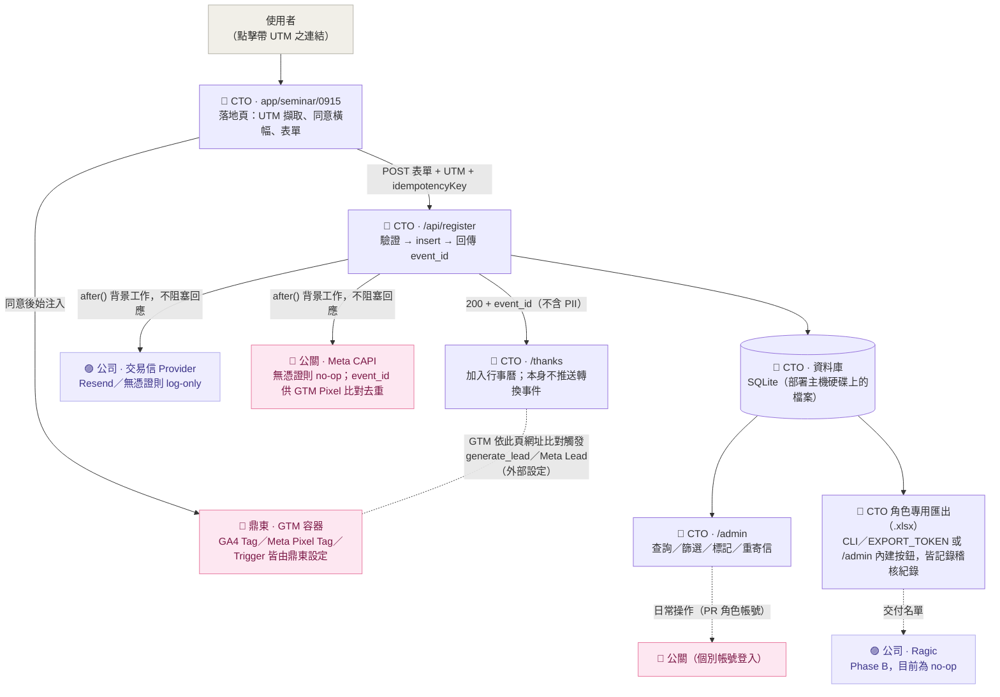

# Agatha 9/15 論壇報名系統


> 對應交接文件《Agatha_Seminar_Landing_Page報名系統與追蹤_CTO交接文件_0729》，實作文件 §0 指派予 CTO／工程之範圍：**報名頁與自建後台、GTM 埋設、GA4／Meta 像素整合、交易信 API 串接與網域驗證、感謝頁、UTM 落庫、後台權限開放予公關**。

規格文件採 OpenSpec 管理，現行 capability spec 之單一真相在 [`openspec/specs/`](openspec/specs/)；已完成之 change 歸檔於 [`openspec/changes/archive/`](openspec/changes/archive/)（含完整 proposal／design／specs／tasks 紀錄，含議程後台管理、個別帳號＋角色權限、Excel 匯出、講者／夥伴／亮點 CMS、表單選項清單 CMS、Banner 上傳＋活動資訊 CMS 等對照交接文件 v3／0804／0805-0806 新需求之規格，詳見下方）。本 README 為系統操作手冊，完整 phase-by-phase 開發歷程與遭遇問題記錄於 [`devlog.md`](devlog.md)；獨立 QA 測試紀錄於 [`qa/test-log-2026-08-04.md`](qa/test-log-2026-08-04.md)。

**目前狀態：本機／staging 已通過獨立 QA 驗證（20 Pass、3 Blocked、0 Fail，詳見下方「已完成測項與待驗證測項」），尚未部署至 production 或 agatha-ai.com。**

---

## 目錄

- [專案說明](#專案說明)
- [與原型 HTML 差異](#與原型-html-差異)
- [交接文件 v3（0804／0805-0806）更新對照](#交接文件-v308040805-0806更新對照)
- [角色與分工](#角色與分工)
- [系統資料流](#系統資料流)
- [追蹤事件字典](#追蹤事件字典對照文件-66-20260806-更新)
- [專案結構](#專案結構)
- [測試步驟](#測試步驟)
- [`.env` 環境變數說明](#env-環境變數說明責任分工對照文件-011)
- [`/admin` 操作說明](#admin-操作說明)
- [資料庫架構：SQLite](#資料庫架構sqlite)
- [§12 測試表對照](#12-測試表對照已完成測項與待驗證測項)
- [待確認事項](#待確認事項可轉知-lindy公關)
- [後續規劃](#後續規劃對照文件-10-關鍵時程)
- [專案進度追蹤](#專案進度追蹤)

---

## 專案說明

Next.js（App Router + TypeScript）全端專案：

- `/seminar/0915` — 報名落地頁（沿用已核准之靜態設計 `agatha-seminar-landing-0803.html` 的文案與樣式，改以 Next.js 頁面實作，並補上實際送出邏輯）
- `/seminar/0915/thanks` — 感謝頁（文件 §8.2 官方文案，含加入行事曆；GA4／Meta 的報名轉換判定改由外部 GTM 依此頁網址設定 Trigger，程式碼不再推送轉換事件，見下方「追蹤事件」說明）
- `/admin` — CTO／公關共用之報名後台，採個別帳號＋角色（`CTO`／`PR`）登入，非共用密碼
- `/admin/accounts` — 帳號管理（CTO 專屬，新增／停用帳號、重設密碼）
- `/admin/agenda`、`/admin/speakers`、`/admin/partners`、`/admin/highlights`、`/admin/form-options`、`/admin/banner`、`/admin/event-info` — 內容管理（議程／講者／合作夥伴／活動亮點／報名表單選項清單／Hero Banner／活動資訊四張卡片），CTO／公關皆可操作，儲存後落地頁下次載入即反映
- `/api/register` — 報名寫入 API（驗證 → 寫庫 → 非同步寄信／推送 Meta CAPI）
- `scripts/export-registrations.ts` + `/api/export`（CLI／權杖）與 `/api/admin/export`（`/admin` 內建按鈕，CTO 角色限定）— 名單匯出，`.xlsx` 格式，兩條路徑皆僅 CTO 可達，動作記錄於稽核紀錄

---

## 與原型 HTML 差異

畫面（文案、版型、圖片、動畫）**沿用原型 `agatha-seminar-landing-0803.html`，未重新設計**。差異集中於「送出之後的處理流程」：

| 項目 | 原型 HTML | 本次 Next.js 實作 |
|---|---|---|
| 送出表單後 | 純前端 JS 驗證欄位，通過後將表單隱藏並切換為「已送出」畫面——**資料未經任何儲存**，重新整理即消失 | 實際呼叫 `/api/register`，寫入資料庫並永久保存 |
| UTM（`utm_source=...`） | 未處理，連結尾端參數被忽略 | 網址上的 UTM 參數會被擷取，並隨該筆報名一併存入資料庫 |
| 感謝頁 | 無獨立網址，僅為同頁切換至另一個 `<div>` | 具備獨立網址 `/seminar/0915/thanks`，新增「加入 Google 日曆」「下載 .ics」兩項功能（原型未提供） |
| 追蹤（GTM／GA4／Meta） | 完全未埋設，原始碼中無任何 GTM 相關程式碼 | 已完成 GTM 容器、同意橫幅、兩項前端事件（`lp_view`／`cta_click`）之程式邏輯；GA4 Key Event（`generate_lead`）與 Meta Lead 改由鼎東於 GTM／GA4 後台依感謝頁網址設定 Trigger，不再由前端程式碼推送（2026/08/06 交接文件更新，見下方「事件字典」）；⚠️ **GTM／GA4 埋設暫緩**（2026/08/06 稍晚公關方通知容器代碼即將更換，待新代碼提供後再填入 `.env`，見下方「待確認事項」）；感謝頁與確認信寄送邏輯**不受影響，可繼續運作** |
| 確認信 | 無此功能 | 已具備寄信邏輯，未設定交易信帳號時僅於伺服器 log 記錄應發送對象，不會實際寄出 |
| Meta CAPI | 無 | 同上，邏輯已完成，未設定憑證時為 no-op |
| 後台（`/admin`） | 不存在 | 新建功能，CTO／公關以個別帳號登入查看名單、篩選、標記處理狀態、重寄確認信 |
| 名單匯出 | 不存在 | CTO 角色專用匯出功能，`.xlsx` 格式（CLI 或 `/admin` 內建按鈕），並記錄稽核紀錄 |

摘要：**畫面沿用原型，資料庫與後台為全新建置；追蹤／寄信等第三方整合管線已完成串接，僅因憑證尚未到位而處於安全的 no-op 狀態，不會因缺少憑證而導致錯誤或流程中斷**。待 GA4／Meta／交易信帳號取得後，僅需將對應數值填入 `.env` 即可啟用，無需修改程式碼。

---

## 交接文件 v3（0804／0805-0806）更新對照

行銷／公關組提出新需求，交接文件更新至 v3（0804），後續於 2026/08/06 再由 Lindy 轉發 0805 修訂版（追蹤層／GTM／GA4 相關）。完整逐項比對見 [`openspec/changes/archive/2026-08-05-add-agenda-management/proposal.md`](openspec/changes/archive/2026-08-05-add-agenda-management/proposal.md)（0804 版）與 [`openspec/changes/archive/2026-08-06-update-tracking-integration/proposal.md`](openspec/changes/archive/2026-08-06-update-tracking-integration/proposal.md)（0805 版），重點摘要：

| 項目 | 摘要 | 狀態 |
|---|---|---|
| **議程可由後台管理** | 公關可從 `/admin/agenda` 新增／編輯／刪除／排序議程，即時反映到落地頁（取代原本寫死的 JSX） | ✅ **已實作並驗證**（見下方「議程管理」） |
| **公關改為個別帳號（非共用密碼）** | v3 §6.9 明文要求「給公關個別帳號（勿共用一組）」，與原 V1 單一共用密碼設計衝突 | ✅ **已實作並驗證**（見下方「帳號管理」；`ADMIN_PASSWORD` 已移除） |
| **名單匯出改 Excel（.xlsx）** | 原為 CSV，且需權限控管並記錄 log | ✅ **已實作並驗證**（CTO 角色限定，動作寫入稽核紀錄，見下方「名單匯出」） |
| **CMS 範圍擴及講者／合作夥伴／活動亮點** | 議程僅為第一階段，v3 §6.2 要求擴及更多區塊 | ✅ **已實作並驗證**（`/admin/speakers`、`/admin/partners`、`/admin/highlights`，見下方「內容管理」） |
| **報名表單選項清單可後台編輯** | v3 §6.2「表單欄」需求，範圍已與你確認限定為「選項清單」，非完整表單建構器 | ✅ **已實作並驗證**（`/admin/form-options`，見下方「內容管理」；欄位種類／順序／單複選型態仍為固定，只有選項內容可編輯） |
| 新子網域 `2026-forum.agatha-ai.com` | 純部署/DNS 層級，路由本身相對路徑，程式碼不受影響 | 不需工程動作 |
| GA4 已開通（`G-L8NZJXKM3J`） | 仍缺 GTM 容器 ID（`NEXT_PUBLIC_GTM_ID`），此項本身不影響程式碼 | 僅供知悉；2026/08/06 文件更新後 GA4 ID 一度換成 `G-C2D5DC3DLS`、GTM 容器一度提供 `GTM-M583KSV7`，但同日稍晚公關方通知容器代碼即將更換，**埋設暫緩，待新代碼**，見下方「追蹤事件字典」與「待確認事項」 |
| UTM 新增「合作夥伴」來源、不分波段 | `utm_source`/`utm_content` 本為自由字串，非固定選項 | ✅ 已相容，無需改動 |
| CMS 範圍擴及 Banner 上傳、活動資訊 | v3 §6.2；桌機／手機 Banner 圖片上傳（精確尺寸校驗）＋活動資訊四張卡片後台編輯 | ✅ **已實作並驗證**（[`add-banner-event-info-cms`](openspec/changes/archive/2026-08-06-add-banner-event-info-cms/)，見下方「內容管理」） |
| **GTM／GA4 憑證到位，GA4 主轉換事件改為 GTM 端設定** | 0805/0806 文件更新：GTM 容器＋GA4 ID 已提供，且改由鼎東維護 Tag／Trigger；`generate_lead` 取代原規劃的 `registration_submit` 自訂事件 | ✅ **已實作並驗證**（[`update-tracking-integration`](openspec/changes/archive/2026-08-06-update-tracking-integration/)，見下方「追蹤事件字典」） |

**目前狀態：議程管理、個別帳號、Excel 匯出、講者／夥伴／亮點 CMS、表單選項清單 CMS、Banner 上傳／活動資訊 CMS 七項已完成並歸檔；新子網域部署尚未動工**，避免一次把不相關的能力全部混進同一個 change。

## 角色與分工

對照交接文件 §0 之角色分工總覽。全篇（含下方系統資料流圖與環境變數說明）採用同一組色點標示各項目之負責歸屬：

| 角色 | 負責事項 | 於本專案之對應 |
|---|---|---|
| 🔵 **CTO／工程**（本次交付範圍） | 報名頁與自建後台、CMS、交易信 API 串接、感謝頁、UTM 落庫、後台權限開放予公關；掛上鼎東提供的 GTM 容器（設定驅動，見下） | 涵蓋幾乎所有程式碼：落地頁、`/api/register`、`/admin`、資料庫、CTO 專用匯出 |
| 🟠 **Lindy（行銷）** | GA4 已開通取得追蹤碼、分發 UTM 連結、對外文案 | 提供 `NEXT_PUBLIC_GA4_ID`（僅供備忘，程式碼不直接讀取，實際由鼎東於 GTM 設定）；透過 `/admin` 或 CTO 匯出名單彙整週報 |
| 🩷 **公關（鼎東）**——**2026/08/06 交接文件更新，角色範圍擴大** | 提供並維護 GTM 容器、建立 GA4 Tag／Meta Pixel／Meta Pixel Tag、設定 Trigger、GTM Preview 測試——這些原本預期由 CTO 建置的追蹤層設定，這次改由鼎東的技術團隊直接操作 | 提供 `NEXT_PUBLIC_GTM_ID`；⚠️ 2026/08/06 稍晚公關方通知先前提供的 `GTM-M583KSV7` 即將更換（容器改由公關方設定後再開放鼎東操作權限），埋設暫緩待新代碼；日常操作 `/admin`（PR 角色個別帳號登入，由 CTO 建立） |
| 🟣 **公司（BD／財務）** | 申辦交易信服務帳號（公司持有）、Ragic 串接 | 提供 `RESEND_API_KEY`／`RAGIC_API_TOKEN` |

---

## 系統資料流



未特別上色之節點（落地頁／API／資料庫／後台／匯出）皆屬 🔵 CTO 本次交付範圍內之程式碼；上色節點為外部整合點，顏色代表憑證／設定負責提供之對象。**2026/08/06 交接文件更新**：GTM 容器改由鼎東提供並自行維護 Tag／Trigger 設定（不再是 Lindy 憑證交給 CTO 埋設），GA4 的關鍵轉換事件（`generate_lead`）與 Meta Lead 事件也改為鼎東在 GTM／GA4 後台依感謝頁網址設定 Trigger，本專案程式碼不再推送任何轉換用的自訂事件，詳見「事件字典」一節。**尚未取得憑證之整合點（Meta CAPI／交易信／Ragic）目前均為安全的 no-op 狀態，不會導致報名流程失敗**，詳見前節「與原型 HTML 差異」。

---

## 追蹤事件字典（對照文件 §6.6，2026/08/06 更新）

| 事件 | 誰觸發 | 用途 |
|---|---|---|
| `lp_view` | 本專案程式碼（`LpViewTracker`），同意橫幅接受後推送一次 | 落地頁瀏覽 |
| `cta_click` | 本專案程式碼（`CtaLink`） | 點擊「立即報名」按鈕，微轉換訊號 |
| `page_view` | GTM 內建（All Pages Trigger），非本專案程式碼推送 | GA4 基本瀏覽事件 |
| `generate_lead` | **鼎東**於 GTM／GA4 後台設定（Trigger：`page_view`，Page Location 包含 `/seminar/0915/thanks`） | GA4 Key Event，本次活動報名轉換／UTM 成效分析依據 |
| Meta `Lead` | **鼎東**於 GTM 後台設定（同樣以感謝頁網址判定，避免用 Submit Button Trigger） | Meta 廣告最佳化與轉換歸因 |

**這次交接文件更新（0804 → 0805/0806）的關鍵變化**：原本規劃由本專案程式碼在報名成功後推送一個自訂的 `registration_submit` 事件作為 GA4 主轉換依據；0805 版文件明確改為「本次不另外建立 `registration_submit` 事件，GA4 以 `generate_lead` 作為正式報名完成事件」，且 `generate_lead`／Meta `Lead` 都改成鼎東在 GTM／GA4 後台直接設定「網址比對」的 Trigger，不需要本專案程式碼推送任何轉換事件。對應的 `ThanksTracker` 元件與 `registration_submit` 事件型別已移除（見 [`openspec/changes/archive/2026-08-06-update-tracking-integration/`](openspec/changes/archive/2026-08-06-update-tracking-integration/)）。

程式碼這邊唯一要保證的是：感謝頁網址維持 `/seminar/0915/thanks` 不變（本就如此），讓鼎東設定的 Trigger 能比對得到；`event_id` 仍會透過 `?eid=` 帶到感謝頁網址上（不含個資），供鼎東設定的 Meta Pixel 標籤與後端 Meta CAPI 呼叫做去重比對。

---

## 專案結構

單一 Next.js 全端專案（**非**多套件 monorepo——落地頁、API、後台皆位於同一 App Router 專案內，以路由劃分職能，並未拆分為獨立 package）：

```
seminar_apply/
├─ app/
│  ├─ layout.tsx                              # 全站 layout，掛載 GtmLoader
│  ├─ globals.css                              # 原始設計稿 CSS 1:1 沿用 + 新元件樣式
│  ├─ seminar/0915/
│  │  ├─ page.tsx                              # 🔵 報名落地頁（含議程區塊，動態渲染 force-dynamic）
│  │  └─ thanks/page.tsx                       # 🔵 感謝頁
│  ├─ admin/
│  │  ├─ page.tsx                              # 🔵 後台列表頁（依角色顯示帳號管理／匯出按鈕）
│  │  ├─ agenda/page.tsx · speakers/page.tsx · partners/page.tsx · highlights/page.tsx · form-options/page.tsx · banner/page.tsx · event-info/page.tsx  # 🔵 內容管理，CTO／PR 皆可用
│  │  ├─ accounts/page.tsx                     # 🔵 帳號管理頁（CTO 專屬，頁面層 redirect 防 PR 直接進入）
│  │  └─ login/page.tsx                        # 🔵 後台登入頁（email + 密碼）
│  └─ api/
│     ├─ register/route.ts                     # 🔵 報名寫入 API（核心流程，驗證 schema 依目前 FormOption 動態建立）
│     ├─ export/route.ts                       # 🔵 CTO 專用匯出（獨立 token，CLI 用，輸出 .xlsx）
│     └─ admin/
│        ├─ login/route.ts · logout/route.ts
│        ├─ registrations/route.ts · registrations/[id]/review/route.ts · registrations/[id]/resend/route.ts
│        ├─ agenda/route.ts · speakers/route.ts · partners/route.ts · highlights/route.ts（各自 + [id]/route.ts + [id]/move/route.ts）
│        ├─ form-options/route.ts · form-options/[field]/route.ts（+ [id]/route.ts + [id]/move/route.ts）  # 🔵 7 個表單欄位共用同一組 CRUD
│        ├─ banner/route.ts                     # 🔵 GET 目前 Banner／POST 上傳（桌機／手機分開，含尺寸校驗）
│        ├─ event-info/route.ts · event-info/[field]/route.ts  # 🔵 GET 四張卡片／PATCH 單張（無 POST/DELETE，固定 4 格）
│        ├─ accounts/route.ts · accounts/[id]/route.ts  # 🔵 CTO-only：帳號列表／新增／停用／重設密碼
│        └─ export/route.ts                     # 🔵 CTO 角色限定，session 驗證，寫入稽核紀錄
├─ components/                                 # RegistrationForm, ConsentBanner, GtmLoader, AdminTable, AgendaTable, SpeakerTable, PartnerTable, HighlightTable, FormOptionsTable, PartnerWall, AccountsTable, AddToCalendar, BannerUploader, EventInfoTable...
├─ lib/
│  ├─ prisma.ts · session.ts · auth.ts · gtm.ts · utm.ts
│  ├─ export-workbook.ts                        # `.xlsx` 產生邏輯，CLI 腳本與兩支匯出 API 共用
│  ├─ form-options.ts                           # 選項清單種子資料來源（不再被表單／驗證 schema 於執行期讀取）
│  ├─ form-options-db.ts                        # 從 FormOption 資料表查詢並依欄位分組，供落地頁與報名 API 共用
│  ├─ registration-schema.ts                    # `buildRegistrationSchema(options)`，改為依當下選項清單動態建立
│  └─ integrations/                             # 🟠🩷🟣 email.ts · meta-capi.ts · ragic.ts（無憑證即 no-op + log）
├─ prisma/
│  ├─ schema.prisma                             # Registration、AgendaItem、AdminAccount、AdminAuditLog、Speaker、Partner、Highlight、FormOption、Banner、EventInfo model
│  ├─ seed-agenda.ts · seed-speakers.ts · seed-partners.ts · seed-highlights.ts · seed-form-options.ts · seed-event-info.ts  # 內容種子資料，各自對應一個 npm script，只需手動跑一次（Banner 無種子，起始為空）
│  └─ seed-admin.ts                             # 建立第一個 CTO 帳號（`npm run seed:admin`，全新環境必跑）
├─ scripts/export-registrations.ts              # 🔵 CTO 專用匯出腳本，輸出 .xlsx
├─ middleware.ts                                # 保護 /admin、/api/admin
├─ public/uploads/banner/                       # Banner 上傳圖片實際存放位置，本機磁碟，已列入 .gitignore（非原始碼，不進版控）
├─ openspec/
│  ├─ specs/                                    # 現行 capability spec 單一真相（含 agenda-management、speakers-cms、partners-cms、highlights-cms、form-options-cms、banner-cms、event-info-cms）
│  └─ changes/archive/                          # 已完成並歸檔之 change（含完整 proposal/design/specs/tasks 紀錄）
├─ qa/test-log-2026-08-04.md                    # 獨立 QA 測試紀錄
├─ .env / .env.example
├─ README.md                                    # 本檔
├─ devlog.md                                    # 逐 phase 開發紀錄
├─ agatha-seminar-landing-0803.html             # 原始已核准設計稿（保留作為內容來源，未刪除）
└─ Agatha_..._CTO交接文件_*.docx                # 交接文件各版本（本機保留作為規格來源；標註 Confidential，已加入 .gitignore，不進版控）
```

---

## 測試步驟

**`.env` 與 `prisma/dev.db` 皆已列入 `.gitignore`（含機密資訊／二進位檔案，本就不該進版控），代表每一次全新 `git clone`（例如換一台機器）都不會有這兩個檔案，須手動建立一次，否則會直接連不上或資料庫查詢失敗：**

```bash
npm install

# 1) 建立 .env（.gitignore 排除，clone 下來不會有這個檔案）
cp .env.example .env
# 打開 .env，至少要填：
#   SESSION_SECRET       隨機字串，可用下面這行產生：
#     node -e "console.log(require('crypto').randomBytes(32).toString('hex'))"
#   EXPORT_TOKEN          隨意設一組，CTO 專用匯出（CLI）的權杖，刻意跟後台登入密碼分開
#   INITIAL_CTO_EMAIL     第一個 CTO 帳號的 email，僅 seed 時使用一次
#   INITIAL_CTO_PASSWORD  第一個 CTO 帳號的密碼，僅 seed 時使用一次
# 其餘（GTM/GA4/Meta/Email/Ragic 相關）留空即可，程式會安全地不啟用該功能

# 2) 建立資料庫結構（prisma/dev.db 也被 .gitignore 排除，clone 下來是空的）
npx prisma migrate dev

# 3) 灌入內容初始資料（AgendaItem／Speaker／Partner／Highlight／FormOption／EventInfo 表建好後都是空的；
#    不跑這幾步，落地頁對應區塊會是空白，不是壞掉。Banner 無對應 seed 指令，起始為空，見下方說明）
npm run seed:agenda
npm run seed:speakers
npm run seed:partners
npm run seed:highlights
npm run seed:form-options
npm run seed:event-info

# 4) 建立第一個 CTO 帳號（AdminAccount 表建好後是空的；不跑這步無法登入 /admin，已有帳號時會自動跳過）
npm run seed:admin

npm run dev              # http://localhost:3000
```

漏掉第 1 步：伺服器啟動或登入時會直接噴 `SESSION_SECRET is not configured`；漏掉 `INITIAL_CTO_EMAIL`／`INITIAL_CTO_PASSWORD` 則第 4 步會報錯要求先設定。漏掉第 2 步：畫面看起來正常，但 `/admin` 或報名送出會回傳資料庫錯誤（`no such table`），且**目前版本會在畫面上直接顯示這則錯誤訊息**，不會再是一片空白的當機畫面。漏掉第 3 步裡的 `seed:agenda`／`seed:speakers`／`seed:partners`／`seed:highlights`：不會報錯，落地頁對應區塊單純沒有任何內容（空清單本就是合法狀態，見各 CMS capability spec），從對應的 `/admin/*` 頁面手動新增即可補上，或事後再跑一次同一個 seed 指令（已有資料時會自動跳過、不會重複塞資料）。**漏掉 `seed:form-options` 則不只是畫面空白**：報名表單會沒有任何選項可選，且 `POST /api/register` 會直接回 500（驗證 schema 需要每個欄位至少有一個選項才能建立），等於整個報名功能是壞的，不是某個區塊空白而已，務必確認這一步有跑。漏掉 `seed:event-info`：落地頁「活動資訊」四張卡片會直接不顯示對應卡片（元件逐筆檢查資料是否存在，缺資料的卡片直接跳過，不會壞版），從 `/admin/event-info` 手動編輯即可補上。Banner 沒有 seed 指令：全新環境本就是「尚未上傳」狀態，落地頁 Hero Banner 區塊會整個不顯示（原設計稿的 Hero 底色／文字仍照常顯示），這是正常的初始狀態，需要有人從 `/admin/banner` 實際上傳圖片才會出現。漏掉第 4 步：`/admin/login` 輸入任何帳密都會是「帳號或密碼錯誤」，因為資料庫裡還沒有任何帳號可以比對。

---

## `.env` 環境變數說明（責任分工，對照文件 §0／§11）

| 變數 | 用途 | 負責提供 | 未設定時之行為 |
|---|---|---|---|
| `DATABASE_URL` | 本機 SQLite 檔案路徑，供 Prisma CLI（migrate/studio）使用 | 🔵 CTO | 詳見下方「資料庫架構」 |
| `TURSO_DATABASE_URL` / `TURSO_AUTH_TOKEN` | **選用**。留空即為純 SQLite（部署主機硬碟上的檔案），CTO＋公關透過同一個部署網址即可讀寫同一份資料，不需要這兩個變數 | 🔵 CTO（僅在想改用 Turso 時才需要） | 未設定：應用程式使用部署主機上的 SQLite 檔案（預設模式） |
| `SESSION_SECRET` | 後台登入 cookie 簽章密鑰 | 🔵 CTO（隨機字串即可） | 未設定將直接報錯，刻意避免以弱密鑰悄悄運作 |
| `EXPORT_TOKEN` | CTO 專用匯出端點（CLI／`/api/export`）之權杖，**刻意與後台登入分開**，PR 角色帳號即使登入 `/admin` 也拿不到這個權杖 | 🔵 CTO 自行保管，不轉交公關 | 未設定則無法使用 `/api/export` |
| `INITIAL_CTO_EMAIL` / `INITIAL_CTO_PASSWORD` | 僅供 `npm run seed:admin` 使用一次，建立資料庫裡第一個 `CTO` 角色帳號 | 🔵 CTO | 未設定：`seed:admin` 直接報錯並中止，不會建立帳號 |
| `NEXT_PUBLIC_GTM_ID` | GTM 容器 ID | 🩷 鼎東（2026/08/06 文件更新：容器＋內部 Tag／Trigger 皆由鼎東維護，非 CTO 建置） | 未設定：網站將完全不注入 GTM 腳本，不影響運作；⚠️ **2026/08/06 稍晚更新：公關方通知先前提供的 `GTM-M583KSV7` 容器代碼即將更換，暫緩埋設，待對方提供新代碼後再填入**（本機 `.env` 目前留空，未寫入任何容器 ID，不受影響） |
| `NEXT_PUBLIC_GA4_ID` | 備忘用途（GA4 於 GTM 容器內設定，本站不直接讀取） | 🟠 Lindy（GA4 已開通） | 不影響程式運作；⚠️ 同上，`G-C2D5DC3DLS` 是否隨容器代碼一併更換待確認 |
| `META_CAPI_TOKEN` / `META_PIXEL_ID` | Meta Conversions API 伺服器端事件 | 🩷 公關公司（文件 §5） | 未設定：`sendMetaCAPI` 為 no-op + log，不影響報名流程 |
| `EMAIL_PROVIDER` / `RESEND_API_KEY` / `EMAIL_FROM` | 報名確認信 | 🟣 公司申辦交易信帳號（文件 §6.5） | `EMAIL_PROVIDER=none` 時為 log-only，不寄信亦不報錯 |
| `RAGIC_API_TOKEN` / `RAGIC_BASE_URL` | Ragic 名單同步（Phase B，尚未實作實際串接邏輯） | 🟣 BD／🟠 Lindy（文件 §6.2） | 未設定：`syncToRagic` 為 no-op + log |

---

## `/admin` 操作說明

1. 前往 `/admin`，未登入將導向 `/admin/login`，輸入 email／密碼登入——**個別帳號，不再共用一組密碼**（對照文件 v3 §6.9）。
2. 功能涵蓋：依姓名／公司／Email 搜尋、依 `utm_source`／`utm_content`／處理狀態篩選、標記已處理／未處理、對單筆資料重寄確認信；此部分 CTO／PR 兩角色皆可使用。
3. **不提供**刪除功能；**整批匯出僅 CTO 角色可見可用**，PR 角色即使直接呼叫匯出 API 也會收到 403（詳見 openspec 之 `admin-console`／`data-export` spec）。
4. 帳號管理（新增帳號、停用／啟用、重設密碼）僅 CTO 角色可進入，見下方「帳號管理」。
5. 每次登入與每次匯出動作皆寫入稽核紀錄（`AdminAuditLog`），記錄操作帳號與時間。

### 議程管理（`/admin/agenda`）

對照交接文件 v3 新需求（詳見上方「交接文件 v3 更新對照」）：公關可從後台新增／編輯／刪除／排序落地頁議程，不需工程協助或改程式碼重新部署。

- 從 `/admin` 點「管理議程」進入，或直接前往 `/admin/agenda`。
- 每筆議程含時間（自由文字，如 `13:30–13:35`）、標題、講者（休息時段可留空）、是否為休息時段。
- 排序用上下箭頭調整，不支援拖拉（議程項目數量少，上下移動已足夠）。
- 儲存後，落地頁 `/seminar/0915` 下次載入即反映變更——該頁面已設定為動態渲染（`force-dynamic`），不會有舊版被靜態快取的問題。
- CTO／PR 兩角色皆可管理議程，與帳號管理（CTO 專屬）分開。

### 內容管理：講者／合作夥伴／活動亮點（`/admin/speakers`、`/admin/partners`、`/admin/highlights`；報名表單選項清單另見下一節）

比照議程管理的作法，落地頁的講者陣容、合作夥伴牆、活動亮點卡片同樣可由後台管理，CTO／PR 皆可操作：

- **講者管理**：姓名、職稱、簡介、照片網址（可留空）、是否已確認。未確認的講者會在落地頁顯示「待確認」標記；已確認但尚未提供照片的講者顯示「照片待提供」——這對應原設計稿裡的兩種不同狀態，不是同一件事。
- **合作夥伴管理**：名稱、Logo 網址、點擊 Logo 後彈出的介紹文字。
- **活動亮點管理**：標題與內容，落地頁會自動依序標上「亮點一」「亮點二」……不需要自己輸入編號。
- 三者皆支援上下箭頭排序，儲存後落地頁下次載入即反映（與議程同一套機制）。
- **講者／合作夥伴的圖片／Logo 目前只能貼網址，還沒有檔案上傳功能**：這兩個區塊目前仍需工程協助把圖片放到 `/public/images/` 後提供路徑，或使用外部圖床連結。本專案第一個真正的檔案上傳功能已隨 Banner 上傳一併完成（見下一節），未來若要擴及講者／夥伴 Logo，可比照同一套上傳基礎建設實作。

### 內容管理：Hero Banner／活動資訊（`/admin/banner`、`/admin/event-info`）

對照交接文件 v3 §6.2，CTO／PR 皆可操作，這是本專案第一個真正的檔案上傳功能：

- **Banner 上傳**：桌機版（需精確 2560×1440）與手機版（需精確 1080×1350）各自獨立上傳，落地頁依裝置寬度（`860px` 斷點）切換顯示對應圖片；未上傳時 Hero Banner 區塊整個不顯示，不影響原本的 Hero 底色與文字。
- **尺寸不符直接拒絕上傳**，錯誤訊息會明確列出「需要的尺寸」與「收到的尺寸」，不做伺服器端自動裁切／壓縮——這是與你確認過的決策（2026/08/05），避免自動裁切裁到不該裁的地方。
- **換圖即刪除舊檔**：重新上傳同一個插槽（桌機或手機）會立即刪除硬碟上的舊檔案，不保留版本紀錄，避免磁碟無限累積。
- **後台不提供預覽功能**：上傳成功後請直接開啟落地頁確認顯示效果，這是刻意精簡的決策，不是遺漏。
- **活動資訊管理**：日期／時間／地點／費用四張卡片，各自可編輯主要內容／第二行（僅地點使用）／小字內容三個欄位，儲存後落地頁下次載入即反映；**固定 4 張卡片，無新增／刪除功能**——對應活動本身只有這 4 類資訊，不是清單型內容。

### 內容管理：報名表單選項清單（`/admin/form-options`）

對照交接文件 v3「表單欄」新需求，範圍已明確限定為**選項清單可編輯，不是完整表單建構器**：

- 可編輯的是 7 個既有欄位（所屬部門、職稱、所屬產業、公司規模、論壇議程興趣、AI 導入階段、現場諮詢議題）裡「有哪些選項可選」，每個欄位都支援新增／編輯／刪除／排序選項內容。
- **欄位本身不可調整**：欄位的種類（單選／複選／下拉選單）、順序、標籤文字、必填與否都寫死在程式碼裡，這次不開放後台調整——避免變成完整表單建構器，超出目前確認的範圍。
- **每個欄位至少要保留一個選項**：刪除到只剩最後一個時系統會拒絕，這不是限制過度，而是報名表單的驗證邏輯需要每個欄位至少有一個合法選項才能運作。
- **選項清單跟報名驗證即時同步**：後台改了選項，落地頁下次載入會用新清單，同一時間報名 API 也只接受目前這份清單裡的值——如果有人抱著舊版頁面（選項已被後台刪除）送出報名，會被擋下並要求重新整理，不會產生跟目前選項對不上的髒資料。
- 已送出的報名資料是純文字欄位，不會因為後台之後改了選項清單而被回溯更動——「當時填了什麼」永遠保留原貌。

### 帳號管理（`/admin/accounts`，CTO 專屬）

- 僅 CTO 角色看得到 `/admin` 上的「帳號管理」連結；PR 角色即使直接輸入網址，頁面層也會被導回 `/admin`（API 層同樣拒絕，非僅隱藏 UI）。
- 可新增帳號（email／姓名／密碼／角色）、停用／啟用既有帳號、重設密碼。
- **停用而非刪除**：帳號一旦有過登入或匯出紀錄，資料庫層會因稽核紀錄外鍵而拒絕真的刪除該帳號，這是刻意設計（保留稽核紀錄完整性），不是 bug。活動結束後比照文件 v3 §6.9「權限只綁這場活動，結束即回收」的作法是**停用**公關帳號，而非刪除。

### 名單匯出予 Lindy／Ragic（CTO 角色專用，`.xlsx` 格式）

兩種方式擇一，資料內容相同：

```bash
npm run export:registrations   # 產出 exports/registrations-YYYY-MM-DD.xlsx（已列入 .gitignore，內含個資請勿外流）
```

或在 `/admin` 頁面上以 CTO 帳號登入後，直接點「匯出 Excel」按鈕（呼叫 `/api/admin/export`，session 驗證，PR 角色帳號看不到此按鈕、直接呼叫 API 也會收到 403）；也可用 `GET /api/export?token=<EXPORT_TOKEN>` 供 CLI／排程使用。兩條路徑皆會在 `AdminAuditLog` 留下一筆 `export` 紀錄。

---

## 資料庫架構：SQLite

原計畫為本機以 Docker 執行 Postgres（production 目標為 Supabase）；因本機 Docker Desktop 引擎當時無法啟動，先改採 SQLite 應急。**此事後已由主管確認：SQLite 即為正式採用之資料庫，非暫時性偏離，不再規劃切換至 Postgres／Supabase，亦不強制導入 Turso 等第三方託管服務。**

**部署由主管方負責**（含網域），本節僅記錄工程端須留意、與主機選型直接相關的技術限制。

### 唯一的硬性限制：部署主機須提供持久化硬碟

SQLite 是單一檔案（`prisma/dev.db`），寫入的資料就存在「跑這個 app 的那台主機」的硬碟上。這對主機類型有明確要求，**與是否使用 Turso 無關，純 SQLite 部署一樣適用**：

- ✅ **可以**：任何提供持久化硬碟、單一常駐行程的主機（例如一般 VM／VPS，或 Render／Railway／Fly.io 這類平台勾選 persistent volume／disk 的方案）。`dev.db` 放在那台主機硬碟上，CTO＋公關連同一個網址、讀寫同一份資料，符合「純 SQLite」的要求。
- ❌ **不行**：Vercel 預設部署方式這類 **serverless／無狀態** 平台。這類平台不保證檔案系統內容會留著，SQLite 寫入的報名資料可能隨時消失，不是效能或設定問題，是資料真的會不見。

**麻煩把這點轉告主管**：只要主機是「持久化硬碟＋單一常駐服務」這個大類，純 SQLite 完全沒問題，不需要額外處理；工程端不需要知道最終選哪家平台，程式碼跟部署方式無關（`npm run build && npm run start` 即可在任何 Node.js 主機上跑）。

### （選用）Turso 共用資料庫

若之後想要「不綁單一主機硬碟」的做法（例如多主機、免自己顧備份），程式碼已經預留好 Turso（雲端託管 libSQL，仍是 SQLite 方言）的串接：設定 `.env` 的 `TURSO_DATABASE_URL`／`TURSO_AUTH_TOKEN` 即自動改用 Turso；兩者皆留空則自動回退為本機／主機上的 SQLite 檔案，**目前預設就是這個模式，不需要額外設定**。步驟：

1. 至 [turso.tech](https://turso.tech) 註冊帳號、建立資料庫。
2. 複製連線網址填入 `TURSO_DATABASE_URL`，建立 Auth Token 填入 `TURSO_AUTH_TOKEN`。
3. 於 Turso 網頁後台 SQL 主控台執行一次 `prisma/migrations/20260804033703_init/migration.sql` 建表（`prisma migrate deploy` 不直接支援 libSQL 連線）。

這一步是選用，非必要；不執行也完全不影響「純 SQLite」的部署方式。

---

## §12 測試表對照：已完成測項與待驗證測項

已完成一輪**獨立 QA 驗證**（測試者與本文件撰寫者為不同執行單位，逐項對照 `openspec/changes/add-seminar-registration-system/specs/*/spec.md` 七份 capability spec 重新測試，非沿用既有結論），完整紀錄見 [`qa/test-log-2026-08-04.md`](qa/test-log-2026-08-04.md)。結果：**20 Pass、3 Blocked（待真實憑證，非缺陷）、0 Fail**。

**已於本機／staging 完整測試並通過獨立 QA 複測（屬工程權責範圍，不依賴外部帳號）：**

| # | 項目 | 結果 |
|---|---|---|
| 1 | RWD／版面 | 頁面結構、樣式、圖片均依核准設計 1:1 轉譯；未執行視覺截圖比對（瀏覽器分頁未顯示畫面合成），惟 DOM／文字內容／互動邏輯已逐項核對 |
| 2 | 報名送出 | 送出後正確寫入資料庫，並正常導向 `/thanks` ✅ |
| 3 | 表單驗證 | 輸入錯誤格式之 Email 經 API 攔截（400 + 欄位錯誤訊息）✅ |
| 5 | UTM 落庫 | 帶 `utm_source=benchmark&utm_content=wave1` 送出後，後台正確顯示對應資料 ✅ |
| 6 | 波次區隔 | 後台可依 `utm_content` 篩選（`wave1`／`wave2`／`edm1` 三筆來源皆正確區隔）✅ |
| 9 | 後台權限 | 公關帳號可查看／篩選／標記／寄信；確認無刪除鍵、無整批匯出鍵 ✅ |
| 10 | 合規性 | 同意橫幅優先顯示，勾選同意後始注入 GTM；`dataLayer` 事件僅攜帶 `event_id`／UTM，不含 email／phone ✅ |
| — | 冪等性 | 同一 `idempotencyKey` 送出兩次，僅產生一筆紀錄並回傳相同 `event_id` ✅ |
| — | 匯出權限隔離 | PR 角色 session 呼叫 `/api/admin/export` 回傳 403；無 `EXPORT_TOKEN` 呼叫 `/api/export` 回傳 401；CTO 角色／正確權杖方能回傳 200 之 `.xlsx` 檔案 ✅ |
| — | 個別帳號與稽核紀錄 | 停用帳號後無法再登入（401）；登入與匯出動作皆正確寫入 `AdminAuditLog` 並可追溯操作帳號 ✅ |

**待正式憑證到位方能完整驗證，目前僅能確認「程式路徑正確執行、log 已記錄」：**

| # | 項目 | 所需條件 |
|---|---|---|
| 4 | 確認信實際送達 Gmail／Outlook 且未進垃圾郵件匣 | 🟣 交易信服務帳號 + 寄件網域 SPF／DKIM／DMARC 皆需完成（2026/08/06 文件明確列出三項） |
| 7 | GA4 即時報表顯示造訪、`generate_lead` 標記為關鍵事件 | 🩷 鼎東於 GTM／GA4 後台設定 Trigger（比對感謝頁網址），非本專案程式碼推送；⚠️ 2026/08/06 稍晚公關方通知容器代碼即將更換，`G-C2D5DC3DLS` 等既有數值待重新確認 |
| 8 | Meta 像素測試事件工具驗證 | 🩷 鼎東負責建立 Meta Pixel／Pixel Tag／Trigger 並用 Meta Test Events 驗證 |

**QA 過程中發現之環境問題（已排除，非程式碼缺陷）：** 長時間運行之 `next dev` 開發伺服器快取一度損毀，導致 `/seminar/0915/thanks` 短暫回傳 500；經全新 `next build` 與重啟 `next dev` 確認原始碼無誤。**建議 8/5 測試窗口正式開始前，於 staging 環境重新啟動一次服務**，或改以 `next build && next start` 執行（避開 dev 模式 Fast Refresh 的快取風險）。

---

## 待確認事項（可轉知 Lindy／公關）

1. ~~感謝頁與確認信文案「7 個工作天」版本~~——**已確認（2026/08/05）**：採用文件官方版本（不載明天數），與目前程式碼一致，不需改動。
2. `/admin` 已改為個別帳號登入；目前僅有一組 CTO 帳號（由 `seed:admin` 建立），公關的 PR 角色帳號請於 `/admin/accounts` 建立後交付對應人員，交付方式（帳號密碼如何轉交）尚待確認。
3. ~~`agatha-ai.com` 之部署與 DNS 設定~~——**已確認（2026/08/06）**：主管方已知悉並會親自處理，含持久化硬碟主機類型的技術限制，工程端不需再追蹤此項。
4. **（2026/08/06 新增）確認信寄件網域須完成 SPF／DKIM／DMARC 三項 DNS 設定**（0805 文件 §6.8 明確列出）——這是網域層級設定，工程端無法自行完成，需請掌管 `emergence.today`／`agatha-ai.com` DNS 的窗口協助設定，並在申辦交易信服務帳號（Resend）時一併完成網域驗證，否則確認信可能被判定為垃圾郵件或直接退信。
5. ~~GTM／GA4 真實 ID 已提供（`GTM-M583KSV7`／`G-C2D5DC3DLS`）~~——**2026/08/06 稍晚更新（暫緩，非結案）**：公關方於群組通知「GTM（容器）＆ GA4 的埋設可以先等等，因為埋設碼要換」，並說明改由公關方那邊先設定 GTM，再開放鼎東操作權限，更新後的代碼稍晚會另外提供，**在拿到新代碼前工程端不埋設**；感謝頁與確認信寄送不受影響，可照常進行。本機 `.env` 目前 `NEXT_PUBLIC_GTM_ID`／`NEXT_PUBLIC_GA4_ID` 皆為空值，未寫入任何舊代碼，無需回滾程式碼，僅為狀態追蹤更新。
6. **（2026/08/06 新增，已確認無需異動）主管指示確認信寄件人須為 `service@emergence.today`**——查核 `lib/integrations/email.ts` 與 `.env` 皆已使用此位址（`EMAIL_FROM` 預設值與現有設定一致），**程式碼與設定皆已符合，無需修改**。

---

## 後續規劃（對照文件 §10 關鍵時程）

- **8/10 前**：由主管方完成部署與網域設定；工程端僅需確認部署主機屬於「持久化硬碟」類型（見上方「資料庫架構」），純 SQLite 即可運作，不強制要求 Turso。
- **8/11**：開放報名並投放廣告，此時 GTM／GA4（已提供，待部署填入 `.env`）／Meta 像素（鼎東於 GTM 端設定，非 `.env`）／交易信憑證須全數到位。
- **9/7**：官網首頁上線（同網域並存，不在本次交付範圍）。
- **9/12 前**：公關以 Excel 報名名單寄送行前通知——使用 `npm run export:registrations` 或 `/admin` 內建按鈕產出之 `.xlsx`。
- **Phase B**（不阻塞 8/10）：Ragic 即時串接（目前為 no-op stub）。

---

## 專案進度追蹤

> 本表為即時狀態總覽，後續異動請於此同步更新，避免另行查閱 `devlog.md` 追溯現況。`done` = 已完成並驗證；`ongoing` = 程式碼／管線已就緒，仍待外部條件補齊；`open` = 尚未動工，或受外部依賴阻礙且非工程可自行解決。

| 項目 | 狀態 | 備註 |
|---|---|---|
| OpenSpec 規格（proposal/design/specs/tasks） | `done` | 已通過 `validate --strict` |
| 落地頁移植（`/seminar/0915`） | `done` | 文案／樣式 1:1 沿用原型 |
| 報名 API（`/api/register`） | `done` | 驗證、冪等性、fire-and-forget 均已測試 |
| 感謝頁（`/seminar/0915/thanks`） | `done` | 含加入行事曆；2026/08/06 文件更新後不再推送 `registration_submit`，GA4／Meta 轉換改由鼎東於 GTM 依網址設定 Trigger |
| 後台（`/admin`） | `done` | 個別帳號＋角色（CTO／PR）登入；已測試登入／篩選／標記／重寄信 |
| 帳號管理（`/admin/accounts`） | `done` | CTO 專屬；新增／停用／重設密碼皆已測試，API 與頁面層皆拒絕 PR 角色存取 |
| 名單匯出（`.xlsx`，CLI＋`/admin` 按鈕＋`/api/export`） | `done` | 已測試 PR 角色 403、CTO 角色 200 且輸出為有效 `.xlsx`；動作皆寫入稽核紀錄 |
| 稽核紀錄（`AdminAuditLog`） | `done` | 登入、匯出動作已記錄並可追溯操作帳號 |
| README／`devlog.md` | `done` | 依 phase 持續更新中 |
| 本機端到端驗證（§12 測試表工程可測部分） | `done` | 詳見上方測試表 |
| 獨立 QA 測試（`qa/test-log-2026-08-04.md`） | `done` | 20 Pass／3 Blocked／0 Fail，未發現程式碼缺陷 |
| 測試資料清理 | `done` | QA 期間產生之 5 筆可辨識測試資料已於資料庫層清除，目前 0 筆 |
| 🟠🩷🟣 追蹤／寄信／Ragic 整合程式碼 | `ongoing` | 程式碼已完成且安全 no-op，待正式憑證填入 `.env` 方可正式啟用 |
| SQLite 資料庫決策 | `done` | 主管確認**純 SQLite 即可**，不強制 Turso，不再規劃 Postgres／Supabase 切換 |
| 資料庫連線程式碼（`lib/prisma.ts` adapter，Turso 選用／預設純 SQLite） | `done` | 已實作並驗證本機檔案模式；`serverExternalPackages` 已排除 libsql 打包問題；Turso 為選用加值，非必要 |
| 部署與網域 | `ongoing` | 由主管方負責；工程端已告知唯一限制——主機須為持久化硬碟類型（非 Vercel 等 serverless），純 SQLite 才能正常運作 |
| 視覺截圖驗收（RWD） | `done` | 2026/08/05 已於瀏覽器完成桌機／手機截圖驗收：Hero、活動亮點、活動資訊、議程、講者、合作夥伴、報名表單皆正常，手機版單欄排版無跑版；僅驗證靜態畫面，未含動畫效果 |
| 🩷 GTM／GA4 真實 ID | `open`（原 `done`，2026/08/06 稍晚暫緩） | 2026/08/06 上午文件更新一度提供 `GTM-M583KSV7`／`G-C2D5DC3DLS`；同日稍晚公關方通知容器代碼即將更換，埋設暫緩，待新代碼提供後再處理；本機 `.env` 未寫入任何舊代碼，無程式碼層級待回滾事項 |
| 🟣 正式交易信／Ragic 憑證 | `open` | 分別待公司財務／BD 提供，非工程可自行產生 |
| 🩷 Meta Pixel／Pixel Tag／Trigger 建立與測試 | `open` | 改由鼎東技術團隊於 GTM／Meta Business Manager 設定與驗證，非本專案程式碼範圍 |
| `agatha-ai.com` 部署與 DNS | `ongoing` | 2026/08/06 確認由主管方親自處理，工程端不再追蹤此項細節 |
| PR 角色帳號交接予公關 | `done` | 2026/08/06：主管已建立 PR 帳號並直接交付公關 |
| 感謝頁／確認信文案「7 個工作天」版本 | `done` | 2026/08/05 已確認採用文件官方版本（不載明天數），與現行程式碼一致 |
| Phase B：Ragic 即時串接 | `open` | 目前為 no-op stub，待 Ragic API token |
| 議程後台管理（`/admin/agenda`） | `done` | 對照交接文件 v3 新需求；OpenSpec 規格＋實作皆完成，已於瀏覽器驗證 CRUD／排序／權限，`npm run build` 通過 |
| 個別帳號＋角色權限（`admin-accounts`） | `done` | 對照交接文件 v3 §6.9；OpenSpec 規格＋實作皆完成，`ADMIN_PASSWORD` 已移除，改為 email／密碼登入 |
| Excel 匯出（`.xlsx`，角色限定＋稽核紀錄）（`data-export` 更新） | `done` | 對照交接文件 v3；CSV 改為 `.xlsx`，PR 角色不可達，動作記錄稽核紀錄 |
| 講者／夥伴／亮點 CMS（`/admin/speakers`、`/admin/partners`、`/admin/highlights`） | `done` | 對照交接文件 v3 §6.2；OpenSpec 規格＋實作皆完成，CTO／PR 皆可操作，已於瀏覽器驗證 CRUD／排序，`npm run build` 通過；圖片僅支援貼網址，尚無上傳功能（見下方） |
| 表單選項清單 CMS（`/admin/form-options`） | `done` | 對照交接文件 v3 §6.2；範圍限定選項清單（非完整表單建構器，已與你確認）；報名驗證 schema 改為依當下選項動態建立並已驗證與落地頁同步、拒絕已刪除的舊選項值、最後一個選項不可刪除 |
| Banner 上傳／活動資訊 CMS（[`openspec/changes/archive/2026-08-06-add-banner-event-info-cms/`](openspec/changes/archive/2026-08-06-add-banner-event-info-cms/)） | `done` | 對照交接文件 v3 §6.2；OpenSpec 規格＋實作皆完成，`/admin/banner`（桌機 2560×1440／手機 1080×1350 精確尺寸校驗、換圖即刪舊檔）與 `/admin/event-info`（固定 4 張卡片編輯）已於瀏覽器驗證，`npm run build` 通過。過程中發現並修正一個 CSS specificity 缺陷（桌機／手機圖片切換選擇器優先度不足，兩張圖曾同時顯示），已修正並重新驗證兩種視窗寬度 |
| 新子網域部署 | `open` | 已記錄於「交接文件 v3 更新對照」，純部署/DNS 層級，非工程範圍 |
