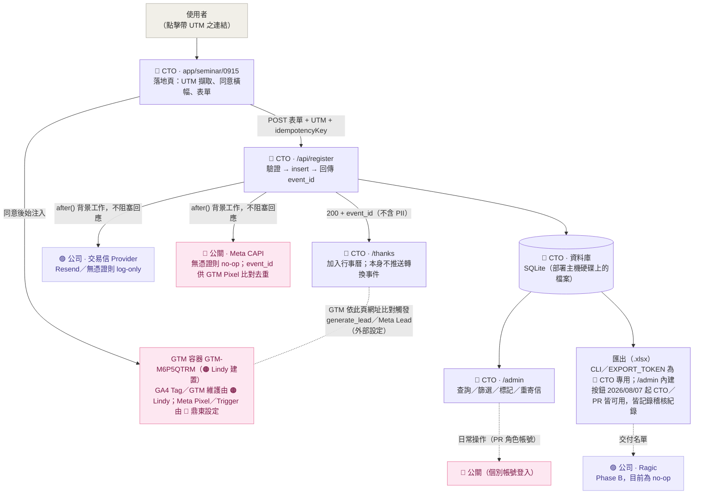

# Agatha 9/15 論壇報名系統


> 對應交接文件《Agatha_Seminar_Landing_Page報名系統與追蹤_CTO交接文件_0729》，實作文件 §0 指派予 CTO／工程之範圍：**報名頁與自建後台、GTM 埋設、GA4／Meta 像素整合、交易信 API 串接與網域驗證、感謝頁、UTM 落庫、後台權限開放予公關**。

規格文件採 OpenSpec 管理，現行 capability spec 之單一真相在 [`openspec/specs/`](openspec/specs/)；已完成之 change 歸檔於 [`openspec/changes/archive/`](openspec/changes/archive/)（含完整 proposal／design／specs／tasks 紀錄，含議程後台管理、個別帳號＋角色權限、Excel 匯出、講者／夥伴／亮點 CMS、表單選項清單 CMS、Banner 上傳＋活動資訊 CMS 等對照交接文件 v3／0804／0805-0806 新需求之規格，詳見下方）。本 README 為系統操作手冊，完整 phase-by-phase 開發歷程與遭遇問題記錄於 [`devlog.md`](devlog.md)；獨立 QA 測試紀錄於 [`qa/test-log-2026-08-04.md`](qa/test-log-2026-08-04.md)。

**目前狀態：本機／staging 已通過獨立 QA 驗證（20 Pass、3 Blocked、0 Fail，詳見下方「已完成測項與待驗證測項」），尚未部署至 production 或 agatha-ai.com。**

---

## 目錄

- [專案說明](#專案說明)
- [與原型 HTML 差異](#與原型-html-差異)
- [交接文件 v3（0804／0805-0806）更新對照](#交接文件-v308040805-0806更新對照)
- [角色與分工](#角色與分工)
- [系統資料流](#系統資料流)
- [追蹤事件字典](#追蹤事件字典對照文件-66-20260806-更新)
- [專案結構](#專案結構)
- [測試步驟](#測試步驟)
- [`.env` 環境變數說明](#env-環境變數說明責任分工對照文件-011)
- [`/admin` 操作說明](#admin-操作說明)
- [資料庫架構：SQLite](#資料庫架構sqlite)
- [§12 測試表對照](#12-測試表對照已完成測項與待驗證測項)
- [待確認事項](#待確認事項可轉知-lindy公關)
- [後續規劃](#後續規劃對照文件-10-關鍵時程)
- [專案進度追蹤](#專案進度追蹤)

---

## 專案說明

Next.js（App Router + TypeScript）全端專案：

- `/seminar/0915` — 報名落地頁（沿用已核准之靜態設計 `agatha-seminar-landing-0803.html` 的文案與樣式，改以 Next.js 頁面實作，並補上實際送出邏輯）
- `/seminar/0915/thanks` — 感謝頁（文件 §8.2 官方文案，含加入行事曆；GA4／Meta 的報名轉換判定改由外部 GTM 依此頁網址設定 Trigger，程式碼不再推送轉換事件，見下方「追蹤事件」說明）
- `/admin` — CTO／公關共用之報名後台，採個別帳號＋角色（`CTO`／`PR`）登入，非共用密碼
- `/admin/accounts` — 帳號管理（CTO 專屬，新增／停用帳號、重設密碼）
- `/admin/agenda`、`/admin/speakers`、`/admin/partners`、`/admin/highlights`、`/admin/form-options`、`/admin/banner`、`/admin/event-info` — 內容管理（議程／講者／合作夥伴／活動亮點／報名表單選項清單／Hero Banner／活動資訊四張卡片），CTO／公關皆可操作，儲存後落地頁下次載入即反映
- `/api/register` — 報名寫入 API（驗證 → 寫庫 → 非同步寄信／推送 Meta CAPI）
- `scripts/export-registrations.ts` + `/api/export`（CLI／權杖，CTO 專用）與 `/api/admin/export`（`/admin` 內建按鈕，**2026/08/07 起 CTO／PR 皆可用**，見下方「名單匯出」）— 名單匯出，`.xlsx` 格式，動作記錄於稽核紀錄

---

## 與原型 HTML 差異

畫面（文案、版型、圖片、動畫）**沿用原型 `agatha-seminar-landing-0803.html`，未重新設計**。差異集中於「送出之後的處理流程」：

| 項目 | 原型 HTML | 本次 Next.js 實作 |
|---|---|---|
| 送出表單後 | 純前端 JS 驗證欄位，通過後將表單隱藏並切換為「已送出」畫面——**資料未經任何儲存**，重新整理即消失 | 實際呼叫 `/api/register`，寫入資料庫並永久保存 |
| UTM（`utm_source=...`） | 未處理，連結尾端參數被忽略 | 網址上的 UTM 參數會被擷取，並隨該筆報名一併存入資料庫 |
| 感謝頁 | 無獨立網址，僅為同頁切換至另一個 `<div>` | 具備獨立網址 `/seminar/0915/thanks`，新增「加入 Google 日曆」「下載 .ics」兩項功能（原型未提供） |
| 追蹤（GTM／GA4／Meta） | 完全未埋設，原始碼中無任何 GTM 相關程式碼 | 已完成 GTM 容器、同意橫幅、兩項前端事件（`lp_view`／`cta_click`）之程式邏輯；GA4 Key Event（`generate_lead`）與 Meta Lead 改由鼎東於 GTM／GA4 後台依感謝頁網址設定 Trigger，不再由前端程式碼推送（2026/08/06 交接文件更新，見下方「事件字典」）；**GTM 容器代碼已定案為 `GTM-M6P5QTRM`**（湧現／Lindy 自建，2026/08/06 下午文件確認，取代先前暫緩的 `GTM-M583KSV7`），待部署時填入 `.env`，安裝範圍為 Landing Page（非全站） |
| 確認信 | 無此功能 | 已具備寄信邏輯；**2026/08/07 起正式站已透過 Gmail SMTP 路徑實際寄出並確認送達**；**同日稍晚改寄 Lindy 設計的 HTML 版型**（純文字版仍同時附上作為 fallback），信中收件人姓名依報名資料動態代入，非寫死 |
| Meta CAPI | 無 | 同上，邏輯已完成，未設定憑證時為 no-op |
| 後台（`/admin`） | 不存在 | 新建功能，CTO／公關以個別帳號登入查看名單、篩選、標記處理狀態、重寄確認信 |
| 名單匯出 | 不存在 | 匯出功能，`.xlsx` 格式；CLI（`EXPORT_TOKEN`）僅 CTO 可用，`/admin` 內建按鈕 2026/08/07 起 CTO／PR 皆可用，兩條路徑皆記錄稽核紀錄 |
| 封存報名資料 | 不存在 | 2026/08/07 新增，CTO 專屬：可將報名資料標記為「已封存」，從預設清單與所有匯出中隱藏，但資料庫底層永不刪除，可隨時取消封存還原；PR 角色看不到此功能 |

摘要：**畫面沿用原型，資料庫與後台為全新建置；追蹤／寄信等第三方整合管線已完成串接，僅因憑證尚未到位而處於安全的 no-op 狀態，不會因缺少憑證而導致錯誤或流程中斷**。待 GA4／Meta／交易信帳號取得後，僅需將對應數值填入 `.env` 即可啟用，無需修改程式碼。

---

## 交接文件 v3（0804／0805-0806）更新對照

行銷／公關組提出新需求，交接文件更新至 v3（0804），後續於 2026/08/06 上午由 Lindy 轉發 0805 修訂版（追蹤層／GTM／GA4 相關），同日下午再收到 0806 版（GTM 容器代碼定案＋確認信／感謝頁文案品牌前綴＋角色分工細化）。完整逐項比對見 [`openspec/changes/archive/2026-08-05-add-agenda-management/proposal.md`](openspec/changes/archive/2026-08-05-add-agenda-management/proposal.md)（0804 版）與 [`openspec/changes/archive/2026-08-06-update-tracking-integration/proposal.md`](openspec/changes/archive/2026-08-06-update-tracking-integration/proposal.md)（0805 版）；0806 下午版差異記錄於 `devlog.md` Phase 33，重點摘要：

| 項目 | 摘要 | 狀態 |
|---|---|---|
| **議程可由後台管理** | 公關可從 `/admin/agenda` 新增／編輯／刪除／排序議程，即時反映到落地頁（取代原本寫死的 JSX） | ✅ **已實作並驗證**（見下方「議程管理」） |
| **公關改為個別帳號（非共用密碼）** | v3 §6.9 明文要求「給公關個別帳號（勿共用一組）」，與原 V1 單一共用密碼設計衝突 | ✅ **已實作並驗證**（見下方「帳號管理」；`ADMIN_PASSWORD` 已移除） |
| **名單匯出改 Excel（.xlsx）** | 原為 CSV，且需權限控管並記錄 log | ✅ **已實作並驗證**（CTO 角色限定，動作寫入稽核紀錄，見下方「名單匯出」） |
| **CMS 範圍擴及講者／合作夥伴／活動亮點** | 議程僅為第一階段，v3 §6.2 要求擴及更多區塊 | ✅ **已實作並驗證**（`/admin/speakers`、`/admin/partners`、`/admin/highlights`，見下方「內容管理」） |
| **報名表單選項清單可後台編輯** | v3 §6.2「表單欄」需求，範圍已與你確認限定為「選項清單」，非完整表單建構器 | ✅ **已實作並驗證**（`/admin/form-options`，見下方「內容管理」；欄位種類／順序／單複選型態仍為固定，只有選項內容可編輯） |
| 新子網域 `2026-forum.agatha-ai.com` | 純部署/DNS 層級，路由本身相對路徑，程式碼不受影響 | 不需工程動作 |
| GA4 已開通（`G-L8NZJXKM3J`） | 仍缺 GTM 容器 ID（`NEXT_PUBLIC_GTM_ID`），此項本身不影響程式碼 | 僅供知悉；2026/08/06 文件更新後 GA4 ID 換成 `G-C2D5DC3DLS`；GTM 容器代碼上午一度提供 `GTM-M583KSV7`（公關公司提供），下午改為湧現／Lindy 自建之 `GTM-M6P5QTRM`（現行、已定案），見下方「追蹤事件字典」 |
| UTM 新增「合作夥伴」來源、不分波段 | `utm_source`/`utm_content` 本為自由字串，非固定選項 | ✅ 已相容，無需改動 |
| CMS 範圍擴及 Banner 上傳、活動資訊 | v3 §6.2；桌機／手機 Banner 圖片上傳（精確尺寸校驗）＋活動資訊四張卡片後台編輯 | ✅ **已實作並驗證**（[`add-banner-event-info-cms`](openspec/changes/archive/2026-08-06-add-banner-event-info-cms/)，見下方「內容管理」） |
| **GTM／GA4 憑證到位，GA4 主轉換事件改為 GTM 端設定** | 0805/0806 文件更新：GTM 容器＋GA4 ID 已提供，內部 Tag／Trigger 改由鼎東維護；`generate_lead` 取代原規劃的 `registration_submit` 自訂事件（GTM 容器代碼於 2026/08/06 下午定案為湧現／Lindy 自建之 `GTM-M6P5QTRM`，取代上午暫緩的 `GTM-M583KSV7`） | ✅ **已實作並驗證**（[`update-tracking-integration`](openspec/changes/archive/2026-08-06-update-tracking-integration/)，見下方「追蹤事件字典」） |
| **講者照片／夥伴 Logo 改為檔案上傳；夥伴拆分主辦／協辦單位** | 2026/08/06 QA（Lindy）測試回報：講者、夥伴需要真正的檔案上傳（不再貼網址）；夥伴需拆分「主辦單位」（今晧實業、湧現智庫）與「協辦單位」，落地頁對應拆成兩個區塊 | ✅ **已實作並驗證**（[`add-speaker-partner-upload`](openspec/changes/archive/2026-08-07-add-speaker-partner-upload/)，見上方「內容管理」） |
| **公關帳號開放整批匯出 Excel 權限** | 2026/08/07 直接指示：放寬 v3 §6.9「全量含個資之名單匯出由我方控管後再提供」的限制，公關需要直接匯出給報名公司，經確認後刻意反轉原本 CTO 限定的設計 | ✅ **已實作並驗證**（[`open-export-to-pr-role`](openspec/changes/archive/2026-08-07-open-export-to-pr-role/)，見下方「名單匯出」） |

**目前狀態：議程管理、個別帳號、Excel 匯出、講者／夥伴／亮點 CMS、表單選項清單 CMS、Banner 上傳／活動資訊 CMS、講者夥伴檔案上傳與夥伴分類、公關匯出權限放寬、落地頁內文 CMS、同意橫幅改通知型 十一項已完成並歸檔；新子網域部署尚未動工**，避免一次把不相關的能力全部混進同一個 change。

## 角色與分工

對照交接文件 §0 之角色分工總覽。全篇（含下方系統資料流圖與環境變數說明）採用同一組色點標示各項目之負責歸屬：

| 角色 | 負責事項 | 於本專案之對應 |
|---|---|---|
| 🔵 **CTO／工程**（本次交付範圍） | 報名頁與自建後台、CMS、交易信 API 串接、感謝頁、UTM 落庫、後台權限開放予**公司公關**（Lindy，非外部公關公司）；於 **Landing Page**（非全站）安裝 Lindy 提供的 GTM 容器代碼 | 涵蓋幾乎所有程式碼：落地頁、`/api/register`、`/admin`、資料庫、CTO 專用匯出 |
| 🟠 **Lindy（公司公關／行銷，湧現內部）**——**2026/08/06 下午更新**：GTM 容器改由 Lindy 自行建立 | **GTM 容器建置與維護**（`GTM-M6P5QTRM`，湧現自開，非外部公關公司提供）、GA4 Tag 建立、GTM Preview 測試——範圍為自營通路（Benchmark 電子報、Agatha 自營 FB／LinkedIn）；`/admin` 擁有**完整 CMS 權限**（見下方「帳號管理」對「公司公關 vs 公關公司」的區分） | 提供 `NEXT_PUBLIC_GTM_ID`（`GTM-M6P5QTRM`，已提供可埋設）；日常操作 `/admin`（PR 角色個別帳號登入，由 CTO 建立） |
| 🩷 **鼎東（外部公關公司之技術團隊）**——**權限範圍限定** | 於 Lindy 開放 Editor 權限之 GTM 容器內建立 **Meta Pixel／Meta Pixel Tag、Meta Lead Event Trigger**、GTM Preview 測試——範圍限定 **Meta 與 Digitimes** 兩個投放通路；**不開放 `/admin` CMS 權限**（外部公關公司，非本專案之公司公關） | 於 GTM 容器內設定 Meta 相關 Tag／Trigger；不持有任何本專案帳號 |
| 🟣 **公司（BD／財務）** | 申辦交易信服務帳號（公司持有）、Ragic 串接 | 提供 `RESEND_API_KEY`／`RAGIC_API_TOKEN` |

**「公司公關」與「公關公司」不是同一件事**：Lindy 是**湧現內部**的公關／行銷人員（🟠，上表列為「公司公關」），對本專案 CMS 有完整權限；鼎東是**外部委託的公關代理商**技術團隊（🩷，上表列為「公關公司」），僅負責 Meta／Digitimes 相關的追蹤設定，**不持有、也不開放 `/admin` 任何帳號或 CMS 權限**——這正是交接文件 §9 驗收 Checklist「不提供公關公司 CMS 權限」這條的意思，跟本專案 PR 角色帳號（給 Lindy 用）完全對得起來，不衝突。

---

## 系統資料流



未特別上色之節點（落地頁／API／資料庫／後台／匯出）皆屬 🔵 CTO 本次交付範圍內之程式碼；上色節點為外部整合點，顏色代表憑證／設定負責提供之對象。**2026/08/06 上午交接文件更新**：GTM 容器內部的 GA4 Tag／Meta Pixel Tag／Trigger 設定改由鼎東維護，GA4 的關鍵轉換事件（`generate_lead`）與 Meta Lead 事件也改為鼎東在 GTM／GA4 後台依感謝頁網址設定 Trigger，本專案程式碼不再推送任何轉換用的自訂事件，詳見「事件字典」一節。**2026/08/06 下午再更新（定案）**：GTM 容器本身改由**湧現內部（Lindy）自建**（`GTM-M6P5QTRM`，取代上午的 `GTM-M583KSV7`），CTO 只需把容器代碼安裝到 **Landing Page**（非全站），鼎東取得 Editor 權限、範圍限定 Meta／Digitimes 兩通路，Lindy 負責容器維護＋GA4 Tag＋自營通路（Benchmark、Agatha 自營社群）。**尚未取得憑證之整合點（Meta CAPI／交易信／Ragic）目前均為安全的 no-op 狀態，不會導致報名流程失敗**，詳見前節「與原型 HTML 差異」。

---

## 追蹤事件字典（對照文件 §6.6，2026/08/06 更新）

| 事件 | 誰觸發 | 用途 |
|---|---|---|
| `lp_view` | 本專案程式碼（`LpViewTracker`），頁面載入後立即推送一次（**2026/08/10 起不再等同意橫幅**，見下方說明） | 落地頁瀏覽 |
| `cta_click` | 本專案程式碼（`CtaLink`） | 點擊「立即報名」按鈕，微轉換訊號 |
| `page_view` | GTM 內建（All Pages Trigger），非本專案程式碼推送 | GA4 基本瀏覽事件 |
| `generate_lead` | **鼎東**於 GTM／GA4 後台設定（Trigger：`page_view`，Page Location 包含 `/seminar/0915/thanks`） | GA4 Key Event，本次活動報名轉換／UTM 成效分析依據 |
| Meta `Lead` | **鼎東**於 GTM 後台設定（同樣以感謝頁網址判定，避免用 Submit Button Trigger） | Meta 廣告最佳化與轉換歸因 |

**這次交接文件更新（0804 → 0805/0806）的關鍵變化**：原本規劃由本專案程式碼在報名成功後推送一個自訂的 `registration_submit` 事件作為 GA4 主轉換依據；0805 版文件明確改為「本次不另外建立 `registration_submit` 事件，GA4 以 `generate_lead` 作為正式報名完成事件」，且 `generate_lead`／Meta `Lead` 都改成鼎東在 GTM／GA4 後台直接設定「網址比對」的 Trigger，不需要本專案程式碼推送任何轉換事件。對應的 `ThanksTracker` 元件與 `registration_submit` 事件型別已移除（見 [`openspec/changes/archive/2026-08-06-update-tracking-integration/`](openspec/changes/archive/2026-08-06-update-tracking-integration/)）。

程式碼這邊唯一要保證的是：感謝頁網址維持 `/seminar/0915/thanks` 不變（本就如此），讓鼎東設定的 Trigger 能比對得到；`event_id` 仍會透過 `?eid=` 帶到感謝頁網址上（不含個資），供鼎東設定的 Meta Pixel 標籤與後端 Meta CAPI 呼叫做去重比對。

### 2026/08/10 起：同意橫幅改為「通知型」，GTM 不再等使用者按下同意

原本 GTM 容器（及其內建的 GA4／Meta 追蹤）採**真正的選擇性同意機制**：使用者沒點下橫幅上的「我同意」之前，`GtmLoader.tsx` 完全不會注入 GTM 腳本，`lp_view` 也不會推送——這是對照交接文件隱私規範刻意做的設計，且已於 2026/08/10 上午實測確認運作正常（見下方待確認事項第 8 項）。

同一天稍晚，公關公司（鼎東）回報 GA4／Meta 後台幾乎收不到資料——原因正是這個機制運作得太好：多數使用者由左至右點擊的習慣，加上橫幅提供「僅使用必要功能」這個看起來對等的拒絕選項，導致大部分訪客實際上是在拒絕追蹤，GTM 因此從未載入。與你確認（[`AskUserQuestion`](openspec/changes/archive/2026-08-10-make-consent-banner-notice-only/)，選項裡已明確列出「這會拿掉使用者真正拒絕追蹤的能力，建議先跟法遵／主管確認」的風險說明）後，**改成單一按鈕的「通知型」橫幅**：

- GTM／`lp_view` 現在頁面載入時就無條件觸發，完全不受橫幅是否顯示、是否被點擊影響。
- 橫幅只剩一個「我知道了」按鈕（拿掉「僅使用必要功能」——保留一個按下去其實什麼都不會拒絕的按鈕，本身就是一種誤導性設計，不留半吊子）。
- 按鈕改成更醒目的樣式（字級 15px、字重 700、更大的內距、綠色陰影），對照 Lindy 提供的參考範例，避免使用者滑過去沒注意到。
- `lib/gtm.ts` 的函式名稱同步從 `hasTrackingConsent`／`grantTrackingConsent` 改成 `hasNoticeBeenDismissed`／`dismissNotice`，避免程式碼名稱繼續暗示這裡還有真的在把關的同意機制。

**這是刻意逆轉先前的隱私優先設計，法遵風險由你（CTO）在確認選項裡已知悉的情況下拍板決定，非工程單方面判斷**——完整脈絡與風險陳述記錄在 [`openspec/changes/archive/2026-08-10-make-consent-banner-notice-only/`](openspec/changes/archive/2026-08-10-make-consent-banner-notice-only/) 的 proposal.md／design.md。

---

## 專案結構

單一 Next.js 全端專案（**非**多套件 monorepo——落地頁、API、後台皆位於同一 App Router 專案內，以路由劃分職能，並未拆分為獨立 package）：

```
seminar_apply/
├─ app/
│  ├─ layout.tsx                              # 全站 layout，掛載 GtmLoader
│  ├─ globals.css                              # 原始設計稿 CSS 1:1 沿用 + 新元件樣式
│  ├─ seminar/0915/
│  │  ├─ page.tsx                              # 🔵 報名落地頁（含議程區塊，動態渲染 force-dynamic）
│  │  └─ thanks/page.tsx                       # 🔵 感謝頁
│  ├─ admin/
│  │  ├─ page.tsx                              # 🔵 後台列表頁（依角色顯示帳號管理／匯出按鈕）
│  │  ├─ agenda/page.tsx · speakers/page.tsx · partners/page.tsx · highlights/page.tsx · form-options/page.tsx · banner/page.tsx · event-info/page.tsx · intro-copy/page.tsx  # 🔵 內容管理，CTO／PR 皆可用
│  │  ├─ accounts/page.tsx                     # 🔵 帳號管理頁（CTO 專屬，頁面層 redirect 防 PR 直接進入）
│  │  └─ login/page.tsx                        # 🔵 後台登入頁（email + 密碼）
│  └─ api/
│     ├─ register/route.ts                     # 🔵 報名寫入 API（核心流程，驗證 schema 依目前 FormOption 動態建立）
│     ├─ export/route.ts                       # 🔵 CTO 專用匯出（獨立 token，CLI 用，輸出 .xlsx）
│     └─ admin/
│        ├─ login/route.ts · logout/route.ts
│        ├─ registrations/route.ts · registrations/[id]/review/route.ts · registrations/[id]/resend/route.ts
│        ├─ agenda/route.ts · speakers/route.ts · partners/route.ts · highlights/route.ts（各自 + [id]/route.ts + reorder/route.ts）
│        ├─ speakers/[id]/upload/route.ts · partners/[id]/upload/route.ts  # 🔵 講者照片／夥伴 Logo 檔案上傳，沿用 Banner 上傳模式
│        ├─ form-options/route.ts · form-options/[field]/route.ts（+ [id]/route.ts + [id]/move/route.ts）  # 🔵 7 個表單欄位共用同一組 CRUD
│        ├─ banner/route.ts                     # 🔵 GET 目前 Banner／POST 上傳（桌機／手機分開，含尺寸校驗）
│        ├─ event-info/route.ts · event-info/[field]/route.ts  # 🔵 GET 四張卡片／PATCH 單張（無 POST/DELETE，固定 4 格）
│        ├─ intro-copy/route.ts · intro-copy/[field]/route.ts  # 🔵 GET 兩段內文／PATCH 單段（無 POST/DELETE，固定 2 格）
│        ├─ registrations/[id]/archive/route.ts # 🔵 CTO-only：PATCH 封存／取消封存單筆報名（無 delete）
│        ├─ accounts/route.ts · accounts/[id]/route.ts  # 🔵 CTO-only：帳號列表／新增／停用／重設密碼
│        └─ export/route.ts                     # session 驗證（2026/08/07 起 CTO／PR 皆可用），寫入稽核紀錄
├─ components/                                 # RegistrationForm, ConsentBanner, GtmLoader, AdminTable, AgendaTable, SpeakerTable, PartnerTable, HighlightTable, FormOptionsTable, PartnerWall, AccountsTable, AddToCalendar, BannerUploader, EventInfoTable, IntroCopyTable...
├─ lib/
│  ├─ prisma.ts · session.ts · auth.ts · gtm.ts · utm.ts
│  ├─ export-workbook.ts                        # `.xlsx` 產生邏輯，CLI 腳本與兩支匯出 API 共用
│  ├─ form-options.ts                           # 選項清單種子資料來源（不再被表單／驗證 schema 於執行期讀取）
│  ├─ form-options-db.ts                        # 從 FormOption 資料表查詢並依欄位分組，供落地頁與報名 API 共用
│  ├─ registration-schema.ts                    # `buildRegistrationSchema(options)`，改為依當下選項清單動態建立
│  ├─ render-bold.tsx                           # 🔵 `**bold**` 簡易標記語法解析，供落地頁內文渲染用
│  └─ integrations/                             # 🟠🩷🟣 email.ts · meta-capi.ts · ragic.ts（無憑證即 no-op + log）；email-templates/ 為確認信 HTML 版型
├─ prisma/
│  ├─ schema.prisma                             # Registration（含 archived）、AgendaItem、AdminAccount、AdminAuditLog、Speaker、Partner（含 PartnerCategory: HOST/COORGANIZER）、Highlight、FormOption、Banner、EventInfo、IntroCopy model
│  ├─ seed-agenda.ts · seed-speakers.ts · seed-partners.ts · seed-highlights.ts · seed-form-options.ts · seed-event-info.ts · seed-intro-copy.ts  # 內容種子資料，各自對應一個 npm script，只需手動跑一次（Banner 無種子，起始為空）
│  └─ seed-admin.ts                             # 建立第一個 CTO 帳號（`npm run seed:admin`，全新環境必跑）
├─ scripts/export-registrations.ts              # 🔵 CTO 專用匯出腳本，輸出 .xlsx
├─ scripts/archive-test-registrations.ts        # 🔵 CTO 專用：CLI 封存正式站測試報名資料（預覽優先，需 --confirm 才寫入）
├─ middleware.ts                                # 保護 /admin、/api/admin
├─ public/uploads/banner/                       # Banner 上傳圖片實際存放位置，本機磁碟，已列入 .gitignore（非原始碼，不進版控）
├─ public/email-assets/                         # 確認信 HTML 版型用的圖片資源，進版控（非使用者上傳內容）
├─ openspec/
│  ├─ specs/                                    # 現行 capability spec 單一真相（含 agenda-management、speakers-cms、partners-cms、highlights-cms、form-options-cms、banner-cms、event-info-cms、intro-copy-cms）
│  └─ changes/archive/                          # 已完成並歸檔之 change（含完整 proposal/design/specs/tasks 紀錄）
├─ qa/test-log-2026-08-04.md                    # 獨立 QA 測試紀錄
├─ .env / .env.example
├─ README.md                                    # 本檔
├─ devlog.md                                    # 逐 phase 開發紀錄
├─ agatha-seminar-landing-0803.html             # 原始已核准設計稿（保留作為內容來源，未刪除）
└─ Agatha_..._CTO交接文件_*.docx                # 交接文件各版本（本機保留作為規格來源；標註 Confidential，已加入 .gitignore，不進版控）
```

---

## 測試步驟

**`.env` 與 `prisma/dev.db` 皆已列入 `.gitignore`（含機密資訊／二進位檔案，本就不該進版控），代表每一次全新 `git clone`（例如換一台機器）都不會有這兩個檔案，須手動建立一次，否則會直接連不上或資料庫查詢失敗：**

```bash
npm install

# 1) 建立 .env（.gitignore 排除，clone 下來不會有這個檔案）
cp .env.example .env
# 打開 .env，至少要填：
#   SESSION_SECRET       隨機字串，可用下面這行產生：
#     node -e "console.log(require('crypto').randomBytes(32).toString('hex'))"
#   EXPORT_TOKEN          隨意設一組，CTO 專用匯出（CLI）的權杖，刻意跟後台登入密碼分開
#   INITIAL_CTO_EMAIL     第一個 CTO 帳號的 email，僅 seed 時使用一次
#   INITIAL_CTO_PASSWORD  第一個 CTO 帳號的密碼，僅 seed 時使用一次
# 其餘（GTM/GA4/Meta/Email/Ragic 相關）留空即可，程式會安全地不啟用該功能

# 2) 建立資料庫結構（prisma/dev.db 也被 .gitignore 排除，clone 下來是空的）
npx prisma migrate dev

# 3) 灌入內容初始資料（AgendaItem／Speaker／Partner／Highlight／FormOption／EventInfo 表建好後都是空的；
#    不跑這幾步，落地頁對應區塊會是空白，不是壞掉。Banner 無對應 seed 指令，起始為空，見下方說明）
npm run seed:agenda
npm run seed:speakers
npm run seed:partners
npm run seed:highlights
npm run seed:form-options
npm run seed:event-info

# 4) 建立第一個 CTO 帳號（AdminAccount 表建好後是空的；不跑這步無法登入 /admin，已有帳號時會自動跳過）
npm run seed:admin

npm run dev              # http://localhost:3000
```

漏掉第 1 步：伺服器啟動或登入時會直接噴 `SESSION_SECRET is not configured`；漏掉 `INITIAL_CTO_EMAIL`／`INITIAL_CTO_PASSWORD` 則第 4 步會報錯要求先設定。漏掉第 2 步：畫面看起來正常，但 `/admin` 或報名送出會回傳資料庫錯誤（`no such table`），且**目前版本會在畫面上直接顯示這則錯誤訊息**，不會再是一片空白的當機畫面。漏掉第 3 步裡的 `seed:agenda`／`seed:speakers`／`seed:partners`／`seed:highlights`：不會報錯，落地頁對應區塊單純沒有任何內容（空清單本就是合法狀態，見各 CMS capability spec），從對應的 `/admin/*` 頁面手動新增即可補上，或事後再跑一次同一個 seed 指令（已有資料時會自動跳過、不會重複塞資料）。**漏掉 `seed:form-options` 則不只是畫面空白**：報名表單會沒有任何選項可選，且 `POST /api/register` 會直接回 500（驗證 schema 需要每個欄位至少有一個選項才能建立），等於整個報名功能是壞的，不是某個區塊空白而已，務必確認這一步有跑。漏掉 `seed:event-info`：落地頁「活動資訊」四張卡片會直接不顯示對應卡片（元件逐筆檢查資料是否存在，缺資料的卡片直接跳過，不會壞版），從 `/admin/event-info` 手動編輯即可補上。Banner 沒有 seed 指令：全新環境本就是「尚未上傳」狀態，落地頁 Hero Banner 區塊會整個不顯示（原設計稿的 Hero 底色／文字仍照常顯示），這是正常的初始狀態，需要有人從 `/admin/banner` 實際上傳圖片才會出現。漏掉第 4 步：`/admin/login` 輸入任何帳密都會是「帳號或密碼錯誤」，因為資料庫裡還沒有任何帳號可以比對。

---

## `.env` 環境變數說明（責任分工，對照文件 §0／§11）

| 變數 | 用途 | 負責提供 | 未設定時之行為 |
|---|---|---|---|
| `DATABASE_URL` | 本機 SQLite 檔案路徑，供 Prisma CLI（migrate/studio）使用 | 🔵 CTO | 詳見下方「資料庫架構」 |
| `TURSO_DATABASE_URL` / `TURSO_AUTH_TOKEN` | **選用**。留空即為純 SQLite（部署主機硬碟上的檔案），CTO＋公關透過同一個部署網址即可讀寫同一份資料，不需要這兩個變數 | 🔵 CTO（僅在想改用 Turso 時才需要） | 未設定：應用程式使用部署主機上的 SQLite 檔案（預設模式） |
| `SESSION_SECRET` | 後台登入 cookie 簽章密鑰 | 🔵 CTO（隨機字串即可） | 未設定將直接報錯，刻意避免以弱密鑰悄悄運作 |
| `EXPORT_TOKEN` | CTO 專用匯出端點（CLI／`/api/export`）之權杖，**刻意與後台登入分開**，PR 角色帳號即使登入 `/admin` 也拿不到這個權杖 | 🔵 CTO 自行保管，不轉交公關 | 未設定則無法使用 `/api/export` |
| `INITIAL_CTO_EMAIL` / `INITIAL_CTO_PASSWORD` | 僅供 `npm run seed:admin` 使用一次，建立資料庫裡第一個 `CTO` 角色帳號 | 🔵 CTO | 未設定：`seed:admin` 直接報錯並中止，不會建立帳號 |
| `NEXT_PUBLIC_GTM_ID` | GTM 容器 ID | 🟠 Lindy（容器本身，湧現自建；內部 Tag／Trigger 則由 🩷 鼎東維護 Meta／Digitimes 部分，2026/08/06 文件更新，非 CTO 建置） | 未設定：網站將完全不注入 GTM 腳本，不影響運作；**真實值已定案：`GTM-M6P5QTRM`**（2026/08/06 下午確認，取代上午暫緩的 `GTM-M583KSV7`），安裝於 Landing Page，部署時填入即可 |
| `NEXT_PUBLIC_GA4_ID` | 備忘用途（GA4 於 GTM 容器內設定，本站不直接讀取） | 🟠 Lindy（GA4 已開通） | 不影響程式運作；⚠️ 同上，`G-C2D5DC3DLS` 是否隨容器代碼一併更換待確認 |
| `META_CAPI_TOKEN` / `META_PIXEL_ID` | Meta Conversions API 伺服器端事件 | 🩷 公關公司（文件 §5） | 未設定：`sendMetaCAPI` 為 no-op + log，不影響報名流程 |
| `EMAIL_PROVIDER` / `RESEND_API_KEY` / `EMAIL_FROM` | 報名確認信（Resend 路徑，需網域 DNS 驗證） | 🟣 公司申辦交易信帳號（文件 §6.5） | `EMAIL_PROVIDER=none` 時為 log-only，不寄信亦不報錯 |
| `GMAIL_USER` / `GMAIL_APP_PASSWORD` | 報名確認信（**2026/08/07 新增**的 Gmail SMTP 替代路徑：`EMAIL_PROVIDER=gmail`，用既有 `service@emergence.today` Gmail 帳號直接寄信，免 DNS/SPF/DKIM 設定） | 🟠 Lindy（[myaccount.google.com/apppasswords](https://myaccount.google.com/apppasswords) 生成，**不是**帳號登入密碼——16 碼小寫字母、4 碼一組） | **✅ 已於正式站設定並實測成功**（2026/08/07）；未設定時，若 `EMAIL_PROVIDER=gmail` 會落回 log-only |
| `EMAIL_ASSET_BASE_URL` | 確認信 HTML 版型裡 Hero 裝飾圖片的絕對網址前綴（見下方「確認信版型」小節） | 🔵 CTO（僅在正式網域改變時才需要設定） | 未設定時預設為現行正式網域 `https://2026-forum.agatha-ai.com`，不影響運作 |
| `RAGIC_API_TOKEN` / `RAGIC_BASE_URL` | Ragic 名單同步（Phase B，尚未實作實際串接邏輯） | 🟣 BD／🟠 Lindy（文件 §6.2） | 未設定：`syncToRagic` 為 no-op + log |

### 確認信版型：HTML 版（2026/08/07）

Lindy 提供了一份設計好的 HTML 版型（原始檔另外交付，未進版控目錄外的下載位置），取代原本純文字信件：

- 版型存放於 [`lib/integrations/email-templates/registration-confirmation.html`](lib/integrations/email-templates/registration-confirmation.html)，這是 Lindy 原始設計檔案的複製，**把信中「吳韻萱 您好，」這行的姓名換成 `{{REGISTRANT_NAME}}` 佔位字串**，其餘版面、文案皆未更動。
- 寄信時（`lib/integrations/email.ts`）讀取此版型，把 `{{REGISTRANT_NAME}}` 換成該筆報名資料實際填寫的姓名——**不是寫死的**，每個人收到的信會顯示自己的名字。姓名代入前會做 HTML escape（防止報名姓名欄位裡如果有 `<`、`&` 等字元破壞信件排版或造成注入）。
- Resend／Gmail SMTP 兩條寄信路徑皆已改帶 `html` 欄位（同時保留原本的純文字 `text` 版本一併附上，作為信箱不支援 HTML 時的 fallback，也有助於避免被判定為垃圾郵件）；`EMAIL_PROVIDER=none` 的 log-only 路徑則不受影響，行為不變。
- 事件日期／時間／地點等其餘內容維持版型原有的靜態文案（與 `EVENT_WHEN`／`EVENT_WHERE` 現行資訊一致），這次僅將收件人姓名改為動態代入，未將整封信改為完全資料庫驅動。
- **Hero 裝飾圖片已改為外部連結，不再內嵌 base64**：Lindy 原始檔案把圖片直接以 `background-image:url('data:image/png;base64,...')` 內嵌在信件裡，整段 base64 資料只有一行、約 38 萬字元長，實測寄出後部分信箱只顯示到圖片那一段就整個「破版」——後面的 HTML 原始碼直接以純文字顯示（如同你截圖看到的），沒有被正常解析成畫面（推測是這一行超過 SMTP／MIME 傳輸慣例上的單行長度限制，中途被中繼郵件伺服器插入不該有的換行，打斷了 HTML 屬性的引號配對，導致收件端的信件解析器從那個位置開始「當機」，把後面全部內容當成純文字顯示）。修正方式是把圖片還原成真正的檔案，透過部署網址公開存取，寄信時做字串替換代入實際網域，整封信的大小也因此從約 400KB 降到約 16KB。
- **Hero 圖片已改用實際的 banner 設計稿**：原本這裡用的是一張抽象的裝飾圖（球體/網格圖形），上面另外疊了一段程式碼寫死的標語／標題／日期／標籤文字，後來（2026/08/10）先改成落地頁同一份 banner 圖檔取代寫死文字，「報名成功」徽章當時仍維持另外用程式碼畫、疊在圖片下方。**同一天稍晚 Lindy 又提供一版新設計稿，把「報名成功」徽章也直接畫進圖片本身**，因此改用**這份 email 專用的版本**（跟落地頁 `/admin/banner` 上傳的圖已經是不同檔案，不要互相搞混／不要拿這張圖去換落地頁的 banner），程式碼裡另外畫的「報名成功」徽章區塊已整段移除，避免跟圖片裡的重複。圖片存在 [`public/email-assets/hero-banner.jpg`](public/email-assets/hero-banner.jpg)（1122×1402，JPEG 壓縮）。
- ~~「報名成功」勾勾圖示跑版~~——**已由上一項取代（2026/08/10）**：原本程式碼另外畫了一顆「報名成功 ✓」綠色徽章疊在圖片下方，其中的勾勾符號在部分信箱（實測是 Gmail）會被當成表情符號渲染、擠成兩行跑版；當天稍晚這顆徽章改成直接畫進 Hero 圖片本身（見上一項），程式碼裡原本畫徽章的區塊已整段移除，這個跑版問題已不存在（沒有程式碼畫的勾勾符號了，自然不會再有渲染方式不一致的問題）。

---

## `/admin` 操作說明

1. 前往 `/admin`，未登入將導向 `/admin/login`，輸入 email／密碼登入——**個別帳號，不再共用一組密碼**（對照文件 v3 §6.9）。
2. 功能涵蓋：依姓名／公司／Email 搜尋、依 `utm_source`／`utm_content`／處理狀態篩選、標記已處理／未處理、對單筆資料重寄確認信；此部分 CTO／PR 兩角色皆可使用。
3. **不提供**永久刪除功能。整批匯出（`/admin` 內建按鈕）**2026/08/07 起 CTO／PR 皆可用**——這是刻意放寬交接文件 §6.9「全量含個資之名單匯出由我方控管後再提供」的限制，經與你確認是直接指示（公關需要直接匯出給報名公司，不用每次都經過 CTO 轉交），非工程端自行決定；帳號管理仍僅 CTO 可進入（詳見 openspec 之 `admin-console`／`data-export` spec，`add-admin-accounts` 原始設計與 `2026-08-07-open-export-to-pr-role` 這次的放寬異動皆已歸檔）。**2026/08/07 新增「封存」功能（CTO 專屬，PR 完全看不到）**：可把報名資料標記為已封存，從預設清單與所有匯出（`.xlsx`／CLI）中隱藏，但資料庫底層永不刪除，可隨時於「顯示已封存」篩選畫面取消封存還原——這是你要求「刪除測試報名資料」後，比照帳號管理「停用而非刪除」的作法所做的決定（詳見 [`openspec/changes/archive/2026-08-07-add-cto-archive-registrations/`](openspec/changes/archive/2026-08-07-add-cto-archive-registrations/)）。
4. 帳號管理（新增帳號、停用／啟用、重設密碼）僅 CTO 角色可進入，見下方「帳號管理」。
5. 每次登入與每次匯出動作皆寫入稽核紀錄（`AdminAuditLog`），記錄操作帳號與時間。

### 議程管理（`/admin/agenda`）

對照交接文件 v3 新需求（詳見上方「交接文件 v3 更新對照」）：公關可從後台新增／編輯／刪除／排序落地頁議程，不需工程協助或改程式碼重新部署。

- 從 `/admin` 點「管理議程」進入，或直接前往 `/admin/agenda`。
- 每筆議程含時間（自由文字，如 `13:30–13:35`）、標題、講者（休息時段可留空）、是否為休息時段。
- 排序用上下箭頭調整，不支援拖拉（議程項目數量少，上下移動已足夠）。
- 儲存後，落地頁 `/seminar/0915` 下次載入即反映變更——該頁面已設定為動態渲染（`force-dynamic`），不會有舊版被靜態快取的問題。
- CTO／PR 兩角色皆可管理議程，與帳號管理（CTO 專屬）分開。

### 內容管理：講者／合作夥伴／活動亮點（`/admin/speakers`、`/admin/partners`、`/admin/highlights`；報名表單選項清單另見下一節）

比照議程管理的作法，落地頁的講者陣容、合作夥伴牆、活動亮點卡片同樣可由後台管理，CTO／PR 皆可操作：

- **講者管理**：姓名、職稱、簡介、照片（檔案上傳，可留空）、是否已確認。未確認的講者會在落地頁顯示「待確認」標記；已確認但尚未上傳照片的講者顯示「照片待提供」——這對應原設計稿裡的兩種不同狀態，不是同一件事。照片需**至少 520×520px**（下限，非精確比對，見下）。
- **合作夥伴管理**：名稱、Logo（檔案上傳，可留空）、點擊 Logo 後彈出的介紹文字，**外加「主辦單位／協辦單位」分類**（2026/08/06 QA 回報新增）。後台畫面拆成「主辦單位管理」「協辦單位管理」兩個分組表格，分類可隨時編輯調整，排序各自獨立（拖曳主辦單位不會影響協辦單位順序，反之亦然）。落地頁對應拆成「主辦單位」（固定為今晧實業、湧現智庫）與「協辦單位」（其餘協辦夥伴，2026/08/07 由「合作夥伴」改名）兩個獨立區塊。Logo 需為 **PNG 格式、寬度至少 800px**（僅驗證格式與寬度，不檢查是否真的透明背景，透明背景由上傳者自行確保）。
- **活動亮點管理**：標題與內容，落地頁會自動依序標上「亮點一」「亮點二」……不需要自己輸入編號。
- 三者皆支援拖曳排序，儲存後落地頁下次載入即反映（與議程同一套機制）。
- **講者照片／合作夥伴 Logo 皆為真正的檔案上傳**（2026/08/07 起，延續 Banner 上傳的同一套基礎建設：`image-size` 尺寸校驗、`public/uploads/` 本機磁碟儲存、換圖即刪舊檔、後台不做預覽），不再是貼網址；新增講者／夥伴時先填文字欄位建立資料，建立後在列表對應那一列上傳照片／Logo。刪除講者／夥伴時，已上傳的檔案也會一併從磁碟清除，不會留下孤兒檔案。

### 內容管理：Hero Banner／活動資訊（`/admin/banner`、`/admin/event-info`）

對照交接文件 v3 §6.2，CTO／PR 皆可操作，這是本專案第一個真正的檔案上傳功能：

- **Banner 上傳**：桌機版（需精確 2560×1440）與手機版（需精確 1080×1350）各自獨立上傳，落地頁依裝置寬度（`860px` 斷點）切換顯示對應圖片。**桌機／手機兩張圖都上傳完成後，會取代原本程式碼寫死的 Hero 區塊**（標題、副標、日期時間、標籤、按鈕等），改成完整顯示你上傳的圖片，不會兩者同時出現（2026/08/10 修正：先前只要上傳任一張圖，程式碼寫死的 Hero 內容還是會照樣顯示在圖片下方，變成「兩塊 banner」疊在一起）；**只上傳其中一張時，為避免另一個裝置寬度看到空白，程式碼寫死的 Hero 區塊仍會保留顯示**，直到兩張都上傳完成才會被取代。
- **尺寸不符直接拒絕上傳**，錯誤訊息會明確列出「需要的尺寸」與「收到的尺寸」，不做伺服器端自動裁切／壓縮——這是與你確認過的決策（2026/08/05），避免自動裁切裁到不該裁的地方。
- **換圖即刪除舊檔**：重新上傳同一個插槽（桌機或手機）會立即刪除硬碟上的舊檔案，不保留版本紀錄，避免磁碟無限累積。
- **後台不提供預覽功能**：上傳成功後請直接開啟落地頁確認顯示效果，這是刻意精簡的決策，不是遺漏。
- **活動資訊管理**：日期／時間／地點／費用四張卡片，各自可編輯主要內容／第二行（僅地點使用）／小字內容三個欄位，儲存後落地頁下次載入即反映；**固定 4 張卡片，無新增／刪除功能**——對應活動本身只有這 4 類資訊，不是清單型內容。

### 內容管理：落地頁內文（`/admin/intro-copy`）

2026/08/10 公關新需求，對照文件 v3 §6.2 同一類「CTO／PR 皆可操作、CTO 不用介入」的內容管理精神，開放編輯 Hero 下方的兩段介紹文字（[`openspec/changes/archive/2026-08-10-add-intro-copy-cms/`](openspec/changes/archive/2026-08-10-add-intro-copy-cms/)）：

- 可編輯**介紹段落**（「當 Agentic AI 進入應用爆發期...」那一段）與**「適合對象」區塊內文**（「Who should attend」下方那段），儲存後落地頁下次載入即反映；**固定 2 個區塊，無新增／刪除功能**——跟活動資訊四張卡片同一種「固定欄位」設計，不是清單型內容。
- **「Who should attend」這個英文小標籤本身維持固定，不開放編輯**——跟頁面上其他區塊小標籤（Highlights／Speakers／Agenda）待遇一致，這幾個目前都不屬於任何後台管理範圍（已與你確認，2026/08/10）。
- **「適合對象」內文支援簡易粗體語法**：輸入時用 `**文字**` 包住想要加粗的部分（例如 `**製造業經營者**`），落地頁會自動轉換成粗體顯示；這不是完整的富文本編輯器，只認得這一種語法，其他符號（例如打錯只打一半的 `**`）會直接照樣顯示成星號，不會被吃掉或誤判（已與你確認，2026/08/10）。介紹段落欄位目前沒有粗體需求，是純文字欄位。

### 內容管理：報名表單選項清單（`/admin/form-options`）

對照交接文件 v3「表單欄」新需求，範圍已明確限定為**選項清單可編輯，不是完整表單建構器**：

- 可編輯的是 7 個既有欄位（所屬部門、職稱、所屬產業、公司規模、論壇議程興趣、AI 導入階段、現場諮詢議題）裡「有哪些選項可選」，每個欄位都支援新增／編輯／刪除／排序選項內容。
- **欄位本身不可調整**：欄位的種類（單選／複選／下拉選單）、順序、標籤文字、必填與否都寫死在程式碼裡，這次不開放後台調整——避免變成完整表單建構器，超出目前確認的範圍。
- **每個欄位至少要保留一個選項**：刪除到只剩最後一個時系統會拒絕，這不是限制過度，而是報名表單的驗證邏輯需要每個欄位至少有一個合法選項才能運作。
- **選項清單跟報名驗證即時同步**：後台改了選項，落地頁下次載入會用新清單，同一時間報名 API 也只接受目前這份清單裡的值——如果有人抱著舊版頁面（選項已被後台刪除）送出報名，會被擋下並要求重新整理，不會產生跟目前選項對不上的髒資料。
- 已送出的報名資料是純文字欄位，不會因為後台之後改了選項清單而被回溯更動——「當時填了什麼」永遠保留原貌。

### 帳號管理（`/admin/accounts`，CTO 專屬）

- 僅 CTO 角色看得到 `/admin` 上的「帳號管理」連結；PR 角色即使直接輸入網址，頁面層也會被導回 `/admin`（API 層同樣拒絕，非僅隱藏 UI）。
- 可新增帳號（email／姓名／密碼／角色）、停用／啟用既有帳號、重設密碼。
- **停用而非刪除**：帳號一旦有過登入或匯出紀錄，資料庫層會因稽核紀錄外鍵而拒絕真的刪除該帳號，這是刻意設計（保留稽核紀錄完整性），不是 bug。活動結束後比照文件 v3 §6.9「權限只綁這場活動，結束即回收」的作法是**停用**公關帳號，而非刪除。

### 封存報名資料（CTO 專屬）

2026/08/07 新增。你提出「想刪除現有測試報名資料」的需求後，比照帳號管理「停用而非刪除」的既有作法而非真的刪庫：

- 在報名列表每一列的操作欄，CTO 角色會多看到一顆「封存」按鈕；PR 角色完全看不到這顆按鈕，也看不到下面的篩選勾選框——不是隱藏，是 API 層本身就拒絕（`PATCH /api/admin/registrations/:id/archive` 對 PR 角色回傳 403）。
- 封存後，該筆資料立即從預設列表、`.xlsx` 匯出（`/admin` 按鈕與 CLI `EXPORT_TOKEN` 兩條路徑）中消失，但**資料庫裡的那一列本身完全沒變動、沒有任何欄位被清空**，只是多了一個 `archived = true` 標記。
- 篩選列勾選「顯示已封存」（同樣僅 CTO 看得到）可切換檢視已封存清單，每一列有「取消封存」按鈕可隨時還原，還原後立刻重新出現在預設列表與匯出結果中。
- **正式站清理現有測試資料**：此功能部署到 EC2 前，若要清空目前正式站資料庫裡的測試報名資料，改用下面這支命令列腳本操作（同樣是封存、不是刪除，效果與之後用 `/admin` 介面手動點「封存」完全相同，之後仍可從 `/admin` 取消封存還原）：

  ```bash
  # 先不加 --confirm，僅預覽目前資料庫裡有哪些未封存的報名資料
  npx tsx scripts/archive-test-registrations.ts

  # 確認清單無誤後，加上 --all --confirm 才會真的封存全部（尚未開放公開報名前，正式站裡通常全部都是測試資料）
  npx tsx scripts/archive-test-registrations.ts --all --confirm

  # 或只封存特定幾筆（用上面預覽列出的 id）
  npx tsx scripts/archive-test-registrations.ts --ids=<id1>,<id2> --confirm
  ```

### 名單匯出予 Lindy／Ragic（CTO 角色專用，`.xlsx` 格式）

兩種方式擇一，資料內容相同：

```bash
npm run export:registrations   # 產出 exports/registrations-YYYY-MM-DD.xlsx（已列入 .gitignore，內含個資請勿外流）
```

或在 `/admin` 頁面上登入後，直接點「匯出 Excel」按鈕（呼叫 `/api/admin/export`，session 驗證；**2026/08/07 起 CTO／PR 皆可看到並使用此按鈕**，見上方「與原型 HTML 差異」的說明）；也可用 `GET /api/export?token=<EXPORT_TOKEN>` 供 CLI／排程使用，這條路徑仍只有拿得到 `EXPORT_TOKEN` 的人（即 CTO）能用。兩條路徑皆會在 `AdminAuditLog` 留下一筆 `export` 紀錄，記錄實際操作的帳號，因此即使 PR 也能匯出，仍可追溯是誰做的。

---

## 資料庫架構：SQLite

原計畫為本機以 Docker 執行 Postgres（production 目標為 Supabase）；因本機 Docker Desktop 引擎當時無法啟動，先改採 SQLite 應急。**此事後已由主管確認：SQLite 即為正式採用之資料庫，非暫時性偏離，不再規劃切換至 Postgres／Supabase，亦不強制導入 Turso 等第三方託管服務。**

**部署由主管方負責**（含網域），本節僅記錄工程端須留意、與主機選型直接相關的技術限制。

### 唯一的硬性限制：部署主機須提供持久化硬碟

SQLite 是單一檔案（`prisma/dev.db`），寫入的資料就存在「跑這個 app 的那台主機」的硬碟上。這對主機類型有明確要求，**與是否使用 Turso 無關，純 SQLite 部署一樣適用**：

- ✅ **可以**：任何提供持久化硬碟、單一常駐行程的主機（例如一般 VM／VPS，或 Render／Railway／Fly.io 這類平台勾選 persistent volume／disk 的方案）。`dev.db` 放在那台主機硬碟上，CTO＋公關連同一個網址、讀寫同一份資料，符合「純 SQLite」的要求。
- ❌ **不行**：Vercel 預設部署方式這類 **serverless／無狀態** 平台。這類平台不保證檔案系統內容會留著，SQLite 寫入的報名資料可能隨時消失，不是效能或設定問題，是資料真的會不見。

**麻煩把這點轉告主管**：只要主機是「持久化硬碟＋單一常駐服務」這個大類，純 SQLite 完全沒問題，不需要額外處理；工程端不需要知道最終選哪家平台，程式碼跟部署方式無關（`npm run build && npm run start` 即可在任何 Node.js 主機上跑）。

### （選用）Turso 共用資料庫

若之後想要「不綁單一主機硬碟」的做法（例如多主機、免自己顧備份），程式碼已經預留好 Turso（雲端託管 libSQL，仍是 SQLite 方言）的串接：設定 `.env` 的 `TURSO_DATABASE_URL`／`TURSO_AUTH_TOKEN` 即自動改用 Turso；兩者皆留空則自動回退為本機／主機上的 SQLite 檔案，**目前預設就是這個模式，不需要額外設定**。步驟：

1. 至 [turso.tech](https://turso.tech) 註冊帳號、建立資料庫。
2. 複製連線網址填入 `TURSO_DATABASE_URL`，建立 Auth Token 填入 `TURSO_AUTH_TOKEN`。
3. 於 Turso 網頁後台 SQL 主控台執行一次 `prisma/migrations/20260804033703_init/migration.sql` 建表（`prisma migrate deploy` 不直接支援 libSQL 連線）。

這一步是選用，非必要；不執行也完全不影響「純 SQLite」的部署方式。

---

## §12 測試表對照：已完成測項與待驗證測項

已完成一輪**獨立 QA 驗證**（測試者與本文件撰寫者為不同執行單位，逐項對照 `openspec/changes/add-seminar-registration-system/specs/*/spec.md` 七份 capability spec 重新測試，非沿用既有結論），完整紀錄見 [`qa/test-log-2026-08-04.md`](qa/test-log-2026-08-04.md)。結果：**20 Pass、3 Blocked（待真實憑證，非缺陷）、0 Fail**。

**已於本機／staging 完整測試並通過獨立 QA 複測（屬工程權責範圍，不依賴外部帳號）：**

| # | 項目 | 結果 |
|---|---|---|
| 1 | RWD／版面 | 頁面結構、樣式、圖片均依核准設計 1:1 轉譯；未執行視覺截圖比對（瀏覽器分頁未顯示畫面合成），惟 DOM／文字內容／互動邏輯已逐項核對 |
| 2 | 報名送出 | 送出後正確寫入資料庫，並正常導向 `/thanks` ✅ |
| 3 | 表單驗證 | 輸入錯誤格式之 Email 經 API 攔截（400 + 欄位錯誤訊息）✅ |
| 5 | UTM 落庫 | 帶 `utm_source=benchmark&utm_content=wave1` 送出後，後台正確顯示對應資料 ✅ |
| 6 | 波次區隔 | 後台可依 `utm_content` 篩選（`wave1`／`wave2`／`edm1` 三筆來源皆正確區隔）✅ |
| 9 | 後台權限 | 公關帳號可查看／篩選／標記／寄信；確認無刪除鍵、無整批匯出鍵 ✅ |
| 10 | 合規性 | ~~同意橫幅優先顯示，勾選同意後始注入 GTM~~——**2026/08/10 起已變更**：橫幅改為單純通知，不再是同意閘門，GTM 頁面載入即無條件注入，詳見上方「追蹤事件字典」小節說明；`dataLayer` 事件僅攜帶 `event_id`／UTM，不含 email／phone，此項不變 ✅ |
| — | 冪等性 | 同一 `idempotencyKey` 送出兩次，僅產生一筆紀錄並回傳相同 `event_id` ✅ |
| — | 匯出權限隔離 | PR 角色 session 呼叫 `/api/admin/export` 回傳 403；無 `EXPORT_TOKEN` 呼叫 `/api/export` 回傳 401；CTO 角色／正確權杖方能回傳 200 之 `.xlsx` 檔案 ✅ |
| — | 個別帳號與稽核紀錄 | 停用帳號後無法再登入（401）；登入與匯出動作皆正確寫入 `AdminAuditLog` 並可追溯操作帳號 ✅ |

**待正式憑證到位方能完整驗證，目前僅能確認「程式路徑正確執行、log 已記錄」：**

| # | 項目 | 所需條件 |
|---|---|---|
| 4 | 確認信實際送達 Gmail／Outlook 且未進垃圾郵件匣 | 🟣 交易信服務帳號 + 寄件網域 SPF／DKIM／DMARC 皆需完成（2026/08/06 文件明確列出三項） |
| 7 | GA4 即時報表顯示造訪、`generate_lead` 標記為關鍵事件 | 🩷 鼎東於 GTM／GA4 後台設定 Trigger（比對感謝頁網址），非本專案程式碼推送；⚠️ 2026/08/06 稍晚公關方通知容器代碼即將更換，`G-C2D5DC3DLS` 等既有數值待重新確認 |
| 8 | Meta 像素測試事件工具驗證 | 🩷 鼎東負責建立 Meta Pixel／Pixel Tag／Trigger 並用 Meta Test Events 驗證 |

**QA 過程中發現之環境問題（已排除，非程式碼缺陷）：** 長時間運行之 `next dev` 開發伺服器快取一度損毀，導致 `/seminar/0915/thanks` 短暫回傳 500；經全新 `next build` 與重啟 `next dev` 確認原始碼無誤。**建議 8/5 測試窗口正式開始前，於 staging 環境重新啟動一次服務**，或改以 `next build && next start` 執行（避開 dev 模式 Fast Refresh 的快取風險）。

---

## 待確認事項（可轉知 Lindy／公關）

1. ~~感謝頁與確認信文案「7 個工作天」版本~~——**已確認（2026/08/05）**：採用文件官方版本（不載明天數），與目前程式碼一致，不需改動。
2. `/admin` 已改為個別帳號登入；目前僅有一組 CTO 帳號（由 `seed:admin` 建立），公關的 PR 角色帳號請於 `/admin/accounts` 建立後交付對應人員，交付方式（帳號密碼如何轉交）尚待確認。
3. ~~`agatha-ai.com` 之部署與 DNS 設定~~——**已確認（2026/08/06）**：主管方已知悉並會親自處理，含持久化硬碟主機類型的技術限制，工程端不需再追蹤此項。
4. ~~確認信寄件網域須完成 SPF／DKIM／DMARC 三項 DNS 設定~~——**已解決（2026/08/07）**：`emergence.today` 網域非本公司持有，Resend 網域驗證需要的 DNS 權限取得有不確定性；改用 **Gmail SMTP 直接寄信**（`EMAIL_PROVIDER=gmail`），因為 `service@emergence.today` 本身已是可用的 Gmail 帳號，用 Google 應用程式密碼透過 Gmail 自己的伺服器寄信，完全不需要碰 DNS。EC2 `.env` 已填入 `GMAIL_USER`／`GMAIL_APP_PASSWORD`，**實測確認信已成功寄達**，此項結案，不再需要 Resend／DNS 網域驗證。
5. ~~GTM／GA4 真實 ID 已提供（`GTM-M583KSV7`／`G-C2D5DC3DLS`）~~——**2026/08/06 下午最終定案**：0806 下午版交接文件確認 GTM 容器改由湧現內部（Lindy）自建 `GTM-M6P5QTRM`（取代上午暫緩的 `GTM-M583KSV7`），CTO 安裝範圍為 **Landing Page**（非全站），鼎東取得 Editor 權限、範圍限定 Meta／Digitimes；GA4 ID 仍為 `G-C2D5DC3DLS`。**待部署時填入 `.env` 的 `NEXT_PUBLIC_GTM_ID`**，本機 `.env` 目前仍為空值。
6. **（2026/08/06 新增，已確認無需異動）主管指示確認信寄件人須為 `service@emergence.today`**——查核 `lib/integrations/email.ts` 與 `.env` 皆已使用此位址（`EMAIL_FROM` 預設值與現有設定一致），**程式碼與設定皆已符合，無需修改**。
7. ~~公關公司是否應有 CMS 權限～與交接文件 §9 checklist「不提供公關公司 CMS 權限」是否衝突~~——**已確認（2026/08/06）**：「公司公關」（Lindy，湧現內部）與「公關公司」（鼎東，外部代理商）是兩個不同對象；PR 角色帳號（CMS 完整權限）僅提供給 Lindy，鼎東不持有本專案任何帳號，與 checklist 要求一致，**不衝突，無需調整權限程式碼**。
8. ~~Lindy 回報 GTM 容器疑似安裝失敗（Console 檢查 `dataLayer` 沒有 `gtm.js` 事件、`google_tag_manager` 是 undefined）~~——**已查證（2026/08/10 上午）：非程式碼問題，是同意橫幅的預期行為**。GTM 依設計採「先同意才載入」（`components/GtmLoader.tsx`），使用者尚未點擊落地頁的「我同意」按鈕之前，`dataLayer` 本來就只會有手動 push 的 `cta_click`，GTM 容器本身完全不會被注入——這是符合隱私規範故意做的節流，不是安裝失敗。直接在正式站實測：**點擊「我同意」之後，`google_tag_manager` 物件、`gtm.js`／`gtm.dom`／`gtm.load` 事件、Meta Pixel noscript 標籤全部正常出現**，容器 ID 正確為 `GTM-M6P5QTRM`。**後續發展（2026/08/10 下午）**：這個「運作正常」的節流機制本身變成了新問題——公關公司回報 GA4／Meta 後台幾乎收不到資料，因為多數訪客習慣直接點拒絕。已與你確認後改成通知型橫幅，GTM 現在無條件載入，詳見「追蹤事件字典」小節說明，此項後續發展已結案。

---

## 後續規劃（對照文件 §10 關鍵時程）

- **8/10 前**：由主管方完成部署與網域設定；工程端僅需確認部署主機屬於「持久化硬碟」類型（見上方「資料庫架構」），純 SQLite 即可運作，不強制要求 Turso。
- **8/11**：開放報名並投放廣告，此時 GTM／GA4（已提供，待部署填入 `.env`）／Meta 像素（鼎東於 GTM 端設定，非 `.env`）／交易信憑證須全數到位。
- **9/7**：官網首頁上線（同網域並存，不在本次交付範圍）。
- **9/12 前**：公關以 Excel 報名名單寄送行前通知——使用 `npm run export:registrations` 或 `/admin` 內建按鈕產出之 `.xlsx`。
- **Phase B**（不阻塞 8/10）：Ragic 即時串接（目前為 no-op stub）。

---

## 專案進度追蹤

> 本表為即時狀態總覽，後續異動請於此同步更新，避免另行查閱 `devlog.md` 追溯現況。`done` = 已完成並驗證；`ongoing` = 程式碼／管線已就緒，仍待外部條件補齊；`open` = 尚未動工，或受外部依賴阻礙且非工程可自行解決。

| 項目 | 狀態 | 備註 |
|---|---|---|
| OpenSpec 規格（proposal/design/specs/tasks） | `done` | 已通過 `validate --strict` |
| 落地頁移植（`/seminar/0915`） | `done` | 文案／樣式 1:1 沿用原型 |
| 報名 API（`/api/register`） | `done` | 驗證、冪等性、fire-and-forget 均已測試 |
| 感謝頁（`/seminar/0915/thanks`） | `done` | 含加入行事曆；2026/08/06 文件更新後不再推送 `registration_submit`，GA4／Meta 轉換改由鼎東於 GTM 依網址設定 Trigger；文案已依 0806 下午版官方文案補上「湧現智庫Agatha · 」品牌前綴 |
| 後台（`/admin`） | `done` | 個別帳號＋角色（CTO／PR）登入；已測試登入／篩選／標記／重寄信 |
| 帳號管理（`/admin/accounts`） | `done` | CTO 專屬；新增／停用／重設密碼皆已測試，API 與頁面層皆拒絕 PR 角色存取 |
| 名單匯出（`.xlsx`，CLI＋`/admin` 按鈕＋`/api/export`） | `done` | 已測試 PR 角色 403、CTO 角色 200 且輸出為有效 `.xlsx`；動作皆寫入稽核紀錄 |
| 稽核紀錄（`AdminAuditLog`） | `done` | 登入、匯出動作已記錄並可追溯操作帳號 |
| README／`devlog.md` | `done` | 依 phase 持續更新中 |
| 本機端到端驗證（§12 測試表工程可測部分） | `done` | 詳見上方測試表 |
| 獨立 QA 測試（`qa/test-log-2026-08-04.md`） | `done` | 20 Pass／3 Blocked／0 Fail，未發現程式碼缺陷 |
| 測試資料清理 | `done` | QA 期間產生之 5 筆可辨識測試資料已於資料庫層清除，目前 0 筆 |
| 🟠🩷🟣 追蹤／寄信／Ragic 整合程式碼 | `ongoing` | 程式碼已完成且安全 no-op，待正式憑證填入 `.env` 方可正式啟用 |
| SQLite 資料庫決策 | `done` | 主管確認**純 SQLite 即可**，不強制 Turso，不再規劃 Postgres／Supabase 切換 |
| 資料庫連線程式碼（`lib/prisma.ts` adapter，Turso 選用／預設純 SQLite） | `done` | 已實作並驗證本機檔案模式；`serverExternalPackages` 已排除 libsql 打包問題；Turso 為選用加值，非必要 |
| 部署與網域 | `ongoing` | 由主管方負責；工程端已告知唯一限制——主機須為持久化硬碟類型（非 Vercel 等 serverless），純 SQLite 才能正常運作 |
| 視覺截圖驗收（RWD） | `done` | 2026/08/05 已於瀏覽器完成桌機／手機截圖驗收：Hero、活動亮點、活動資訊、議程、講者、合作夥伴、報名表單皆正常，手機版單欄排版無跑版；僅驗證靜態畫面，未含動畫效果 |
| 🟠 GTM／GA4 真實 ID | `done` | 2026/08/06 上午一度提供 `GTM-M583KSV7`／`G-C2D5DC3DLS`，下午改為湧現／Lindy 自建之 `GTM-M6P5QTRM`（現行、已定案）；待部署時填入 `.env` 的 `NEXT_PUBLIC_GTM_ID`，安裝範圍為 Landing Page（非全站） |
| 確認信／感謝頁文案：品牌前綴更新 | `done` | 依 0806 下午版官方文案，信件主旨與感謝頁內文補上「湧現智庫Agatha」品牌名稱（`lib/integrations/email.ts`、`app/seminar/0915/thanks/page.tsx`），已於瀏覽器驗證感謝頁顯示正確 |
| 公司公關（Lindy）vs 公關公司（鼎東）CMS 權限釐清 | `done` | 確認交接文件 §9「不提供公關公司 CMS 權限」指外部代理商鼎東，非 Lindy；本專案 PR 角色帳號僅提供給 Lindy，與現行權限設計一致，無需調整程式碼 |
| 🟣 正式交易信憑證 | `done` | 2026/08/07 改走 Gmail SMTP 路徑（`EMAIL_PROVIDER=gmail`），EC2 `.env` 已填入 `GMAIL_USER`／`GMAIL_APP_PASSWORD` 並 `pm2 restart`，**實測確認信已成功寄達**，不再依賴 Resend／DNS 網域驗證 |
| 🟣 Ragic 憑證 | `open` | 待 BD 提供，非工程可自行產生 |
| 🩷 Meta Pixel／Pixel Tag／Trigger 建立與測試 | `open` | 改由鼎東技術團隊於 GTM／Meta Business Manager 設定與驗證，非本專案程式碼範圍 |
| `agatha-ai.com` 部署與 DNS | `ongoing` | 2026/08/06 確認由主管方親自處理，工程端不再追蹤此項細節 |
| PR 角色帳號交接予公關 | `done` | 2026/08/06：主管已建立 PR 帳號並直接交付公關 |
| 感謝頁／確認信文案「7 個工作天」版本 | `done` | 2026/08/05 已確認採用文件官方版本（不載明天數），與現行程式碼一致 |
| Phase B：Ragic 即時串接 | `open` | 目前為 no-op stub，待 Ragic API token |
| 議程後台管理（`/admin/agenda`） | `done` | 對照交接文件 v3 新需求；OpenSpec 規格＋實作皆完成，已於瀏覽器驗證 CRUD／排序／權限，`npm run build` 通過 |
| 個別帳號＋角色權限（`admin-accounts`） | `done` | 對照交接文件 v3 §6.9；OpenSpec 規格＋實作皆完成，`ADMIN_PASSWORD` 已移除，改為 email／密碼登入 |
| Excel 匯出（`.xlsx`，角色限定＋稽核紀錄）（`data-export` 更新） | `done` | 對照交接文件 v3；CSV 改為 `.xlsx`，PR 角色不可達，動作記錄稽核紀錄 |
| 講者／夥伴／亮點 CMS（`/admin/speakers`、`/admin/partners`、`/admin/highlights`） | `done` | 對照交接文件 v3 §6.2；OpenSpec 規格＋實作皆完成，CTO／PR 皆可操作，已於瀏覽器驗證 CRUD／排序，`npm run build` 通過；圖片僅支援貼網址，尚無上傳功能（見下方） |
| 表單選項清單 CMS（`/admin/form-options`） | `done` | 對照交接文件 v3 §6.2；範圍限定選項清單（非完整表單建構器，已與你確認）；報名驗證 schema 改為依當下選項動態建立並已驗證與落地頁同步、拒絕已刪除的舊選項值、最後一個選項不可刪除 |
| Banner 上傳／活動資訊 CMS（[`openspec/changes/archive/2026-08-06-add-banner-event-info-cms/`](openspec/changes/archive/2026-08-06-add-banner-event-info-cms/)） | `done` | 對照交接文件 v3 §6.2；OpenSpec 規格＋實作皆完成，`/admin/banner`（桌機 2560×1440／手機 1080×1350 精確尺寸校驗、換圖即刪舊檔）與 `/admin/event-info`（固定 4 張卡片編輯）已於瀏覽器驗證，`npm run build` 通過。過程中發現並修正一個 CSS specificity 缺陷（桌機／手機圖片切換選擇器優先度不足，兩張圖曾同時顯示），已修正並重新驗證兩種視窗寬度 |
| 講者照片／夥伴 Logo 檔案上傳＋夥伴主辦/協辦分類（[`openspec/changes/archive/2026-08-07-add-speaker-partner-upload/`](openspec/changes/archive/2026-08-07-add-speaker-partner-upload/)） | `done` | 2026/08/06 QA（Lindy）回報；講者照片≥520×520、夥伴 Logo PNG≥800px 寬，皆為檔案上傳（沿用 Banner 上傳基礎建設）；夥伴拆分「主辦單位」（今晧實業、湧現智庫，固定）／「協辦單位」，落地頁與後台皆拆成兩個區塊，排序各自獨立。過程中發現並修正一個既有缺口：刪除講者／夥伴時原本沒有清除已上傳的檔案，已補上，重新驗證刪除後磁碟無殘留 |
| 正式站上傳圖片全部 404（重大 bug 修復） | `done` | 2026/08/07 Lindy 回報上傳照片破圖；查出 `next start` production 模式不會動態發現執行期間新寫入 `public/` 的檔案，新增 `app/uploads/[...path]/route.ts` 直接讀硬碟繞過此限制；本機用真正的 production build 重現＋驗證修復，已 push，待 redeploy 上線後三張既有破圖應自動修復（檔案本就在硬碟上，不需重新上傳） |
| 公關帳號開放整批匯出 Excel 權限（[`openspec/changes/archive/2026-08-07-open-export-to-pr-role/`](openspec/changes/archive/2026-08-07-open-export-to-pr-role/)） | `done` | 2026/08/07 直接指示放寬 v3 §6.9 限制；`/admin` 內建匯出按鈕 CTO／PR 皆可用，CLI（`EXPORT_TOKEN`）路徑仍僅 CTO；已用真正的 production build 驗證 PR 匯出成功且稽核紀錄正確歸屬操作帳號，帳號管理仍僅 CTO 可進入 |
| 講者「更換照片」／夥伴「更換 Logo」按鈕樣式 | `done` | 原本用 `<label>` 包裹檔案輸入框，CSS 選擇器只認 `<button>`，畫面上看起來像純文字；改成真正的 `<button>` 觸發隱藏的檔案輸入框，已於瀏覽器驗證樣式與其他按鈕一致 |
| 封存報名資料（CTO 專屬，[`openspec/changes/archive/2026-08-07-add-cto-archive-registrations/`](openspec/changes/archive/2026-08-07-add-cto-archive-registrations/)） | `done` | 你要求刪除測試報名資料後，比照帳號管理「停用而非刪除」的作法新增：CTO 可封存／取消封存單筆報名資料，封存後從預設清單與所有匯出隱藏、資料庫底層不刪除；PR 角色完全看不到此功能（API 層拒絕，非僅隱藏 UI）。已用真正的 production build 驗證封存／取消封存、匯出排除、PR 403、無任何程式碼路徑呼叫 `delete`；另提供 `scripts/archive-test-registrations.ts` 供你直接在 EC2 上封存正式站現有測試資料，待 redeploy 後執行 |
| 手機版 Hero 區塊排版（第二次調整） | `done` | 2026/08/07：你回報第一次的間距微調（`padding-top:56px`／`.chips margin-top:28px`／`.hero__cta margin-top:36px`）效果不夠明顯，畫面仍偏擠。第二次調整改變策略：不是每個區塊平均加一點間距，而是讓「標題群組」（標語／標題／副標）維持緊湊，「時間地點」與「CTA 按鈕」前各拉開明顯間距（`.hero__event margin-top:38px`、`.hero__cta margin-top:46px`），讓畫面讀起來是 3 個分組而非 6 行等距文字；外層 padding 同時收緊（`40px/40px`），整體高度與調整前接近，但分組更清楚。已用 `getComputedStyle`／`getBoundingClientRect` 於 375px（新數值）與 1280px（桌機數值 `70px/66px` 等完全不變）兩種寬度驗證，`npm run build` 通過 |
| 報名確認信改用 HTML 版型＋收件人姓名動態代入 | `done` | 2026/08/07：Lindy 希望確認信更好看，提供設計好的 HTML 版型；你也指出信中「框起來」的收件人姓名不可寫死，須依實際報名人變化。新增 [`lib/integrations/email-templates/registration-confirmation.html`](lib/integrations/email-templates/registration-confirmation.html)（Lindy 原始設計檔，僅把姓名行換成 `{{REGISTRANT_NAME}}` 佔位字串），寄信時讀取版型並代入該筆報名的實際姓名（**HTML escape 過**，防止姓名欄位內容破壞信件排版或造成注入），Resend／Gmail SMTP 兩條路徑皆已改帶 `html` 欄位，並保留純文字版作為 fallback。**第一版實際寄出後你回報收信變成一整串 HTML 原始碼**——查出是版型裡內嵌的一張 base64 圖片（約 38 萬字元、僅一行）在傳輸過程中被中繼郵件伺服器插入不該有的換行、打斷了 HTML 屬性引號配對；已改為把圖片還原成真正的 PNG 檔案（`public/email-assets/hero-bg.png`）並用外部網址引用，整封信從約 400KB 降到約 16KB，重新驗證單行最長字元數已遠低於容易觸發此問題的門檻 |
| 確認信 Hero 圖片改用真實 banner 設計稿（email 專用版本） | `done` | 2026/08/10 分兩階段：先把確認信裡原本抽象裝飾圖＋寫死文字的 Hero 改成落地頁 banner 圖檔取代（同一天稍早落地頁「兩塊 banner」問題的同類修法），「報名成功」徽章當時仍另外用程式碼畫；同一天稍晚 Lindy 提供把徽章也畫進圖片本身的新版設計稿，改用這份 **email 專屬**圖檔（不再跟落地頁 banner 共用同一份檔案），程式碼裡另外畫徽章的區塊整段移除，原本徽章勾勾符號在 Gmail 等信箱跑版的問題隨之消失（沒有程式碼畫的勾勾了）。已用本機渲染＋瀏覽器驗證圖片正確載入、無重複徽章 |
| Banner／Hero 區塊重複顯示（bug 修復） | `done` | 2026/08/10 Lindy 回報上傳新 banner 後畫面出現「兩塊 banner」；查出是實作沒有依照已核准的 `banner-cms` spec（該 spec 明確寫「以圖片取代原本的 CSS Hero」）——程式碼原本不論有沒有上傳圖片都一律顯示寫死的 Hero 內容，跟新上傳的圖片同時疊在畫面上。修正為：桌機／手機兩張圖都上傳完成後才隱藏寫死的 Hero 內容；只上傳一張時仍保留 Hero 內容顯示，避免另一裝置寬度看到空白。已用本機資料庫分別模擬「兩張都上傳」「只上傳一張」「都沒上傳」三種狀態驗證，並確認導覽列與右下角浮動的報名按鈕不受影響、仍可正常導向報名區塊 |
| 落地頁內文 CMS（`/admin/intro-copy`，[`openspec/changes/archive/2026-08-10-add-intro-copy-cms/`](openspec/changes/archive/2026-08-10-add-intro-copy-cms/)） | `done` | 2026/08/10 公關新需求；Hero 下方「介紹段落」與「適合對象」兩段內文改為 CTO／PR 可從後台編輯，固定 2 個區塊無新增／刪除；「適合對象」支援 `**粗體**` 簡易語法（已與你確認），「Who should attend」小標籤維持固定不開放編輯（已與你確認）。已用真實 API 呼叫驗證 CTO／PR 編輯成功、未登入被拒、無效欄位名稱與空白內容皆正確擋下、未配對的 `**` 顯示為純文字不誤判、資料庫查無資料時落地頁 fallback 回原文不崩潰 |
| 同意橫幅改為通知型，GTM 無條件載入（[`openspec/changes/archive/2026-08-10-make-consent-banner-notice-only/`](openspec/changes/archive/2026-08-10-make-consent-banner-notice-only/)） | `done` | 2026/08/10 公關公司回報 GA4／Meta 後台幾乎收不到資料，因多數訪客習慣拒絕原本的同意閘門；**刻意逆轉先前的隱私優先設計**，與你確認（`AskUserQuestion` 已明確列出法遵風險）後，橫幅改成單一「我知道了」按鈕的通知型設計，GTM／`lp_view` 皆改為頁面載入即無條件觸發，不再受橫幅影響；按鈕視覺加強避免被忽略。已用真正的 production build 驗證（過程中一度在 `npm run dev` 誤判 `lp_view` 遺失，查出是 React Strict Mode dev-only 的雙重執行副作用造成的偽陽性，非真實問題，已在真正的 production build 下確認 `gtm.js`／`lp_view`／`gtm.dom`／`gtm.load` 依序正確觸發） |
| 新子網域部署 | `open` | 已記錄於「交接文件 v3 更新對照」，純部署/DNS 層級，非工程範圍 |
